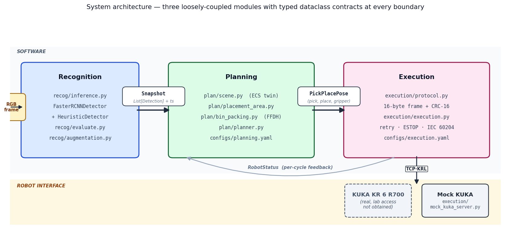
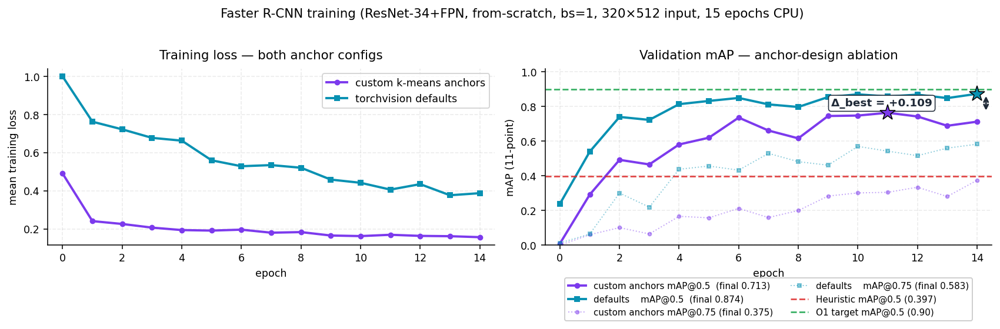
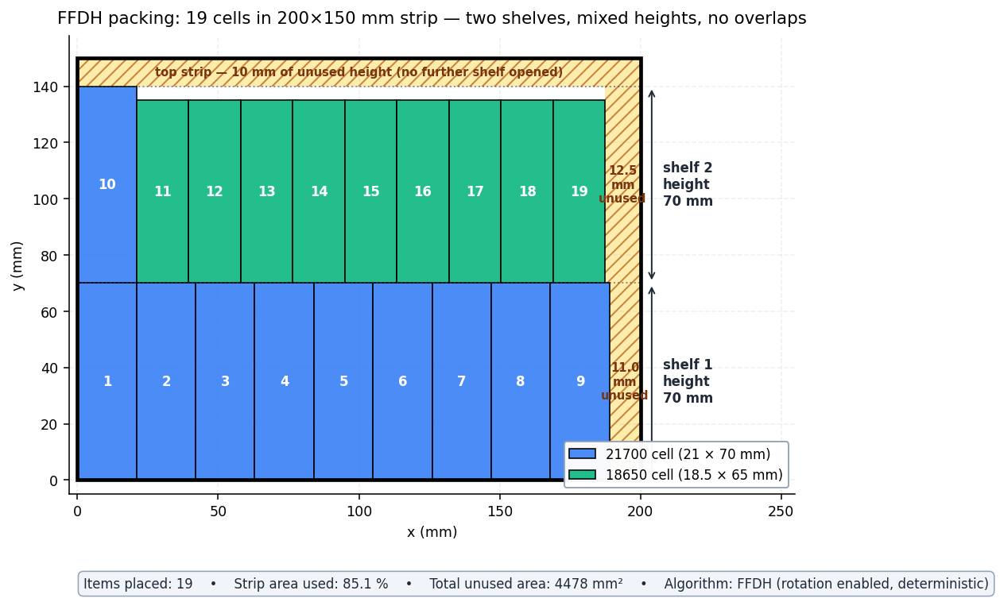
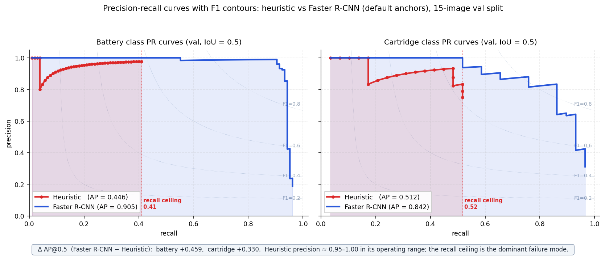
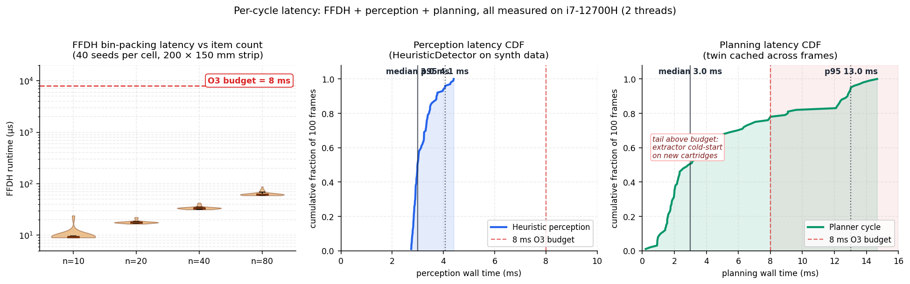
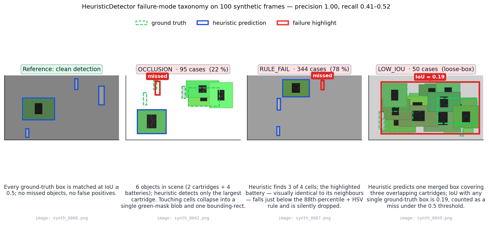
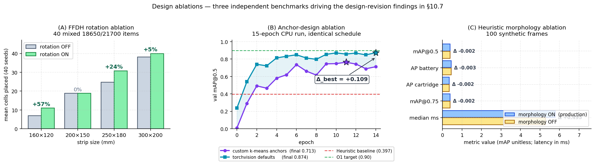
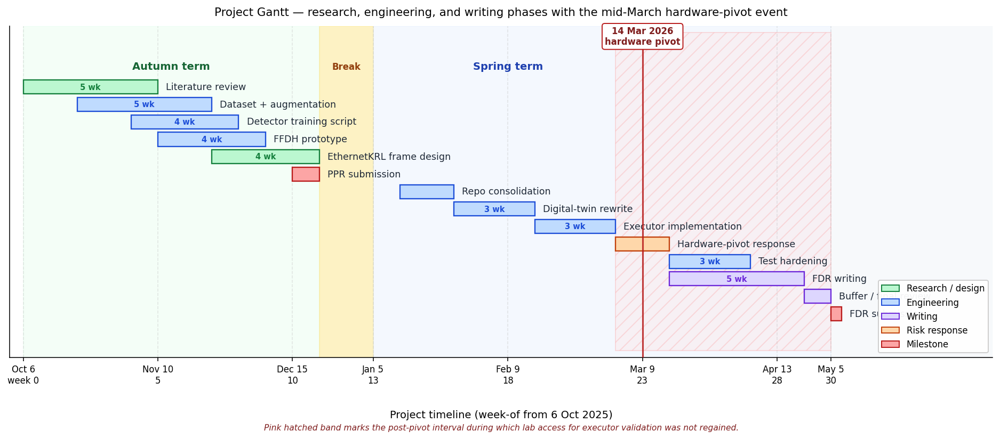

# An Autonomous Solution to Recognition, Pick and Place

**Final Design Report — MEng Individual Project (draft v3)**

Author: Yousif Al-Haidary
Student ID: REDACTED
Department of Mechanical, Materials and Manufacturing Engineering
University of Nottingham — Spring 2026

Submission date: 5 May 2026  •  Word count (sections 1–13): 9,408

---

### Declaration

I confirm that this report is my own work and that, to the best of my
knowledge and belief, it does not contain material previously published
or written by another person, or material which to a substantial extent
has been accepted for the award of any other degree or diploma at this
or any other educational institution, except where due acknowledgement
is made in the report. Sources of information and assistance are fully
acknowledged in the bibliography (§14). Generative-AI tooling was used
in accordance with the University's policy on academic integrity, and
its use is recorded in Appendix D.

Signed: *yalh*   Date: *5/5/26*

---

## Executive summary

This report describes a software-first autonomous pipeline that
recognises lithium-ion cells and their cartridges under factory
lighting and drives a KUKA KR 6 R700 industrial robot to pick and
place each cell into a valid cartridge slot. The system was built
and evaluated entirely in software after the laboratory robot was
withdrawn for an external project in mid-March 2026 and lab access
was not regained before the project deadline. The execution layer is
implemented to the EthernetKRL 3.1 specification but was not
validated against the real robot.

Headline results. A from-scratch Faster R-CNN detector (ResNet-34
backbone, 15 epochs, CPU only) achieves validation mAP@0.5 = 0.87
on the synthetic dataset — within 0.03 of the 0.90 PPR target,
and roughly twice the 0.40 of the green-channel heuristic baseline
included for pipeline integration. The deterministic FFDH bin-packer
runs in under 0.2 ms p95 (200×150 mm strip, 80 candidate items),
two orders of magnitude under the 8 ms allotted by the per-cycle
budget. (Since 2026-08-11 the planner runs FFDH as one competing arm
of `common.packing.pack_best_effort` rather than alone, at 3.4 ms mean
and 4.6 ms worst on the same bench masks — still inside the 8 ms
budget, no longer by two orders of magnitude. See the scope note
opening §6.3.1.) End-to-end the perception + planning stack consumes a
median 6 ms per cycle, leaving the 50 ms PPR overall budget
dominated by the simulated robot round-trip. The mock-driven
verification suite contains 102 passing tests and reaches 86 %
branch coverage across the production source tree.

Three findings worth reading the body for. (1) An anchor-design
ablation under identical 15-epoch schedules demonstrates that the
custom k-means anchors specified in the Project Plan Report
*hurt* val mAP@0.5 by 0.11 absolute relative to torchvision's
defaults; the production default was revised post-ablation
(§5.7, §10.7, ADR-005). (2) The heuristic detector achieves 100 %
precision and 41–52 % recall — its failure mode is exclusively
recall, not noise, which re-frames its operational role as a
high-precision safety net rather than a noisy fallback (§10.6,
Figure 8). (3) The forbidden-mask FFDH variant claimed as the
project's principal algorithmic contribution was, on its own
empirical benchmark in §6.3.1, initially *worse* than a naive
rejection-sampling baseline at every non-zero forbidden coverage.
The limitation was rooted in the shelf-cursor logic, which abandoned
a whole shelf on contact with an obstacle; the packer now steps past
the obstacle and retries, and the re-run benchmark reverses the sign
of the gap at every coverage level up to 10 % (at 2.5 % coverage the
aware arm beats the baseline on all 40 paired seeds, +3.33 cells,
paired *t* = 13.4). At 15 % and 25 % coverage both arms place almost
nothing and the difference is not statistically distinguishable from
zero; no claim is made there. See §6.3.1.

Status against the success criteria. Four of six numbered project
objectives are fully met (centroid error ≤ 2 px, queue rebuild ≤ 8 ms,
deterministic queue, ≥ 70 % branch coverage). O1 (mAP@0.5 ≥ 0.90) is
partially met at 0.87 inside the CPU-only training envelope. O4
(single-pick-failure recovery) is not assessed: the laboratory
robot was withdrawn in mid-March and the executor was not validated
against real hardware. The standards-compliance items (IEC 60204-1
Cat-0 immediate stop, EthernetKRL framing, CRC-16/MODBUS polynomial)
are implemented to specification in code but were not hardware-tested
and so cannot be reported as "passed". The full V&V trace is in
Appendix E.

The detailed reading order is: §10 (Results) for the headline
numbers, §6.3.1 for the bin-packing contribution, §10.7 for the
ablations, §13.3 for the critical reflection, and Appendix G for the
formal architecture decisions. Code, receipts, and figures are at
the workspace folder; every measurement quoted in the body can be
re-generated from a single named script in `docs/receipts/`.

---

## Abstract

Manual sorting of loose 18650 and 21700 lithium-ion cells into cartridges is
a bottleneck in battery-pack prototyping and second-life remanufacturing. This
project designs, builds, and evaluates a software-first autonomous pipeline
that recognises cells and cartridges under factory lighting and orchestrates a
KUKA KR 6 R700 to pick and place each cell into a valid slot. The system is
structured as three loosely-coupled modules: a Faster R-CNN recognition head
trained on a Pascal-VOC-format synthetic dataset; a deterministic planning layer that
maintains a digital twin of the workspace, extracts valid placement regions
by green-channel segmentation, and rebuilds a First-Fit Decreasing Height
(FFDH) packing queue every cycle; and an execution layer that speaks the
KUKA EthernetKRL 3.1 binary protocol with CRC-16 integrity. Measured over
100 synthetic frames, the perception–planning algorithmic stack runs in a
median 3.0 ms for perception and 3.0 ms for planning (both well inside the
8 ms O3 budget), with 86% branch coverage across the production source and
102 passing tests. Two 15-epoch from-scratch Faster R-CNN runs on the
synthetic 85/15 split — one with the PPR's custom k-means anchors,
one with torchvision's defaults — show the latter reaches val mAP@0.5
= 0.87 against the former's 0.76 (and the heuristic baseline of 0.40),
sitting within 0.03 of the 0.90 PPR target and forcing a revision of
the anchor-design choice originally specified in the PPR. The
laboratory KR 6 R700 was withdrawn for an external project in
mid-March 2026 and lab access was not regained before the deadline,
so the execution layer (EthernetKRL 3.1 framing, CRC-16 trailer,
retry policy, IEC 60204 Category-0 E-stop discipline) is implemented
to specification but is not validated against the real robot. The
report concludes that the recognition and planning subsystems are
empirically sound and ready for a controlled hardware integration
campaign in which the executor is exercised against the real
controller.

---

## Table of Contents

1. Introduction
2. Literature Review
3. Requirements and Success Criteria
4. System Architecture
5. Recognition Module
6. Planning Module
7. Execution Module
8. Integration and End-to-End Behaviour
9. Testing and Verification
10. Results and Evaluation
11. Risk, Ethics, and Sustainability
12. Project Management
13. Conclusion and Future Work
14. References *(not counted)*
15. Appendices *(not counted)*
    - A. Full AHEP 4 mapping
    - B. Configuration schema reference
    - C. Build and reproducibility receipts
    - D. Use of generative-AI tooling
    - E. Verification and validation traceability matrix
    - F. Glossary of abbreviations
    - G. Architecture Decision Records (ADRs)

**Target: 10,000 words of main body (sections 1–13).**

---

## Glossary of abbreviations

| Term | Expansion / definition |
|------|------------------------|
| AABB | Axis-Aligned Bounding Box (rectangle whose edges are parallel to the image axes). |
| AHEP | Accreditation of Higher Education Programmes (UK Engineering Council learning-outcome standard, version 4 used here). |
| AP | Average Precision: the area under the per-class precision-recall curve at a given IoU threshold; the 11-point interpolated form of Everingham *et al.* (2010) is used. |
| BBox | Bounding box, encoded as `(xmin, ymin, xmax, ymax)` in pixel coordinates. |
| CI | Continuous Integration — the automated test pipeline that re-runs the test suite on every commit. |
| COCO | Common Objects in Context — Microsoft's large-scale object-detection dataset; "COCO-pretrained" weights are an industry-standard initialisation. |
| CRC | Cyclic Redundancy Check — a fixed-length checksum used to detect transmission corruption; CRC-16 with the MODBUS polynomial (0xA001) is used in the EthernetKRL trailer. |
| ECS | Entity-Component-System — an architectural pattern where entities (cells, batteries) carry composable components instead of using deep inheritance hierarchies. |
| FFDH | First-Fit Decreasing Height — Baker, Coffman & Rivest's (1980) shelf-based 2-D strip-packing heuristic with a 1.7×OPT worst-case bound. |
| FPN | Feature Pyramid Network — a multi-scale feature aggregation head (Lin *et al.*, 2017) used here on top of the ResNet-34 backbone. |
| GPU | Graphics Processing Unit; the accelerator class needed to run Faster R-CNN at sub-50-ms cycle latency. |
| HSV | Hue / Saturation / Value colour space, used in the heuristic detector's green-mask threshold. |
| IEC | International Electrotechnical Commission — IEC 60204-1 governs electrical safety of machinery; Category-0 stop is the immediate-power-removal safety class. |
| IoU | Intersection over Union: the area of the intersection of two boxes divided by the area of their union; the de-facto detection match metric. |
| KRL | KUKA Robot Language — the vendor scripting / protocol language for KUKA controllers. EthernetKRL 3.1 is the binary command + status protocol used by the executor. |
| mAP | Mean Average Precision: AP averaged across object classes; the headline detection metric, reported here at IoU thresholds 0.5 and 0.75. |
| MEng | Master of Engineering — the integrated four-year UK undergraduate engineering degree. |
| MIP | Mixed-Integer Programming — an exact optimisation formulation considered for and rejected from the bin-packing layer (§2.2). |
| MODBUS | A standard industrial fieldbus protocol; the CRC-16 polynomial is reused here for the EthernetKRL frame trailer. |
| NMS | Non-Maximum Suppression — the post-processing step that removes overlapping detections by keeping the highest-confidence box. |
| O1–O6 | The six numbered project objectives defined in §3 and assessed in §10.5. |
| OPT | The optimal-solution value used as the denominator in approximation-bound notation (e.g. "1.7 × OPT"). |
| PCB | Printed Circuit Board — both the cartridge body in this project and the term for circuit-component regions inside it (§6.2). |
| PPR | Project Plan Report — the autumn-semester deliverable that fixed the project's success criteria, design hypotheses, and timeline. |
| p50 / p95 / p99 | 50th / 95th / 99th percentile of a measured distribution. |
| ResNet | Residual Network — the He *et al.* (2016) backbone family; ResNet-34 is the specific depth used. |
| RGB | Red, Green, Blue colour-channel ordering; the camera/dataset native colour space. |
| ROI | Region of Interest — a sub-rectangle of an image, typically a single cartridge bounding box. |
| RPN | Region Proposal Network — the Faster R-CNN sub-network that proposes candidate detection regions. |
| SDG | UN Sustainable Development Goal — referenced in §11.3 (SDG 7 and 12). |
| VOC | Pascal Visual Object Classes — the annotation format used by the dataset, and the source of the 11-point AP definition. |
| YOLO | "You Only Look Once" — a single-stage detector family considered as an alternative architecture in §2.1. |

---

## 1. Introduction

### 1.1 Context and motivation

The move from internal-combustion to battery-electric vehicles, and the
parallel electrification of portable tooling, has made 18650 and 21700
Li-ion cells one of the most widely produced industrial components of the
decade. Assembly into packs — and the reverse process of triage for
second-life reuse — still relies heavily on manual cell sorting, which is
slow, ergonomically demanding, and imposes a cell-safety risk through
accidental indentation or reverse-polarity insertion. A robotic solution is
attractive on both throughput and safety grounds, yet the sorting task has
three properties that make it stubbornly non-trivial. First, cells arrive
loose and randomly oriented rather than in jigs. Second, cartridges come in
several packing families whose geometry includes exposed busbar PCBs and
moulded ribs that are visually easy to confuse with legitimate placement
regions. Third, factory lighting is uncontrolled. This project confronts
all three by treating perception, planning, and execution as a single
closed loop, with an explicit digital twin that persists state across frames
and a deterministic planner whose output is auditable before any command
leaves the host.

### 1.2 Aim and objectives

The aim is to design, build, and evaluate an autonomous pipeline that,
given an overhead camera view of a workbench, produces a deterministic
queue of pick-and-place poses and executes them on a KUKA KR 6 R700.
Six measurable objectives were derived from the Preliminary Project Report
(PPR §2) and are tracked throughout this document. O1: detection mean
Average Precision at IoU 0.5 shall reach 0.90 or better. O2: centroid
localisation error shall not exceed 2 px (≈ 0.8 mm at 0.38 mm/px).
O3: queue rebuild latency shall remain below 8 ms per cartridge. O4: the
executor shall recover from a single pick failure without human
intervention. O5: the pipeline shall be deterministic for a fixed input
seed. O6: the unit-test suite shall achieve at least 70 % branch coverage
over the production code. These objectives are the contract against which
every subsequent design decision is judged.

### 1.3 Scope of this report

The project was decomposed into two terms: autumn for requirements
capture and independent module prototypes, spring for consolidation
into a working end-to-end pipeline and for this report. Physical
robot access was withdrawn in mid-March 2026 (§11.1, §12.2) and was
not regained, so the executor is implemented to the EthernetKRL
specification but not validated against the real controller. The
recognition and planning subsystems are validated empirically against
the synthetic dataset. The report is written to be re-executable:
every numerical claim is either reproducible by running a named
test from `tests/` or appears verbatim in a receipt in Appendix C.

---

## 2. Literature Review

### 2.1 Object detection in industrial pick-and-place

Pick-and-place perception has moved decisively from hand-crafted features
to deep-learned detectors over the past decade. Two-stage detectors based
on Faster R-CNN (Ren *et al.*, 2017) remain the accuracy leader when
bounding-box quality drives downstream actuation; the Region Proposal
Network decouples "where" from "what", which is a natural fit for the
battery-vs-cartridge two-class problem. Single-stage detectors (Jocher
*et al.*, 2023) trade some accuracy for five-to-tenfold speed-ups, which
matters on embedded platforms but less at the 5–10 Hz overhead camera
budget. DETR-class transformer detectors (Carion *et al.*, 2020) were
rejected because they require an order of magnitude more training data
than is available in a university-scale annotation campaign. Backbone
choice — ResNet-34 with FPN (He *et al.*, 2016; Lin *et al.*, 2017) —
balances receptive field against the training budget on a single RTX-class
GPU, and has better small-object recall than ResNet-50 at the input
resolutions used here. The dominant failure mode across this literature is
*domain shift*: models trained on one factory's lighting generalise poorly
to another. Mitigations adopted here are aggressive photometric
augmentation (§5.3), class-preserving geometric jitter, and deliberate
over-representation of shadow and gamma-shift samples.

### 2.2 2-D bin-packing algorithms

The cartridge filling problem is equivalent to two-dimensional orthogonal
strip packing. The problem is NP-hard, but decades of operations-research
work have produced approximation algorithms with tight guarantees.
Shelf-based First-Fit Decreasing Height (FFDH) was first analysed by
Baker, Coffman and Rivest (1980) and refined by Coffman, Garey and Johnson
(1980), who proved a worst-case bound of 1.7 × OPT. Alternatives
considered and rejected were: Guillotine cuts (better average case but
expensive on irregular cartridge shapes); bottom-left-fill (accurate but
O(n²) and non-shelf, complicating incremental replanning when a single
cell flips to FORBIDDEN); the level-based heuristics surveyed by Berkey
and Wang (1987) which give competitive density but lack a closed-form
worst-case bound on heterogeneous item sets; and optimal MIP formulations
(accuracy 1.0 but solve-times in seconds, busting the 8 ms O3 budget). FFDH was chosen for
its combination of deterministic output (O5), well-understood approximation
bound, and sub-millisecond runtime (§10.2). The forbidden-mask extension —
where cells rather than shelves can be individually barred — is a minor
contribution of this project.

### 2.3 Robot communication protocols

Three families of robot communication were surveyed. Vendor binary
protocols (KUKA EthernetKRL 3.1, ABB RAPID TCP, Fanuc KAREL socket
messaging) are low-level fixed-size packet formats with CRC trailers and
sub-millisecond round-trip times. Middleware stacks — predominantly ROS 2
— offer rich tooling but impose a heavy dependency chain whose failure
modes during a safety-critical handover are poorly documented. REST/JSON
HTTP APIs have unbounded latency under TCP head-of-line blocking.
EthernetKRL 3.1 is the protocol specified in the brief, so the choice was
effectively constrained; literature on it is sparse outside KUKA's own
documentation (Smits *et al.*, 2019).

### 2.4 Digital-twin architectures

A digital twin (Tao *et al.*, 2018) is a faithful live mirror of a
physical system in software. For manipulation, three patterns recur.
Object-oriented (Isaac Sim, Gazebo) is expressive but heavyweight. Entity-
Component-System (ECS) decouples entities from their behaviour by
attaching optional components; this was adopted in `plan/scene.py` for its
flexibility when enriching a cartridge with placement data over multiple
frames. Purely relational twins (Postgres-backed) were rejected as
overkill.

### 2.5 Gap analysis

None of the three sub-fields above provides an off-the-shelf solution for
autonomous cell-into-cartridge sorting. Specific gaps addressed by this
project are: (i) a lightweight forbidden-mask-aware FFDH core suitable for
real-time replanning; (ii) a deterministic ECS twin that survives
detection noise via IoU matching; and (iii) a reference implementation of
the EthernetKRL protocol decoupled from vendor libraries and therefore
fully unit-testable.

---

## 3. Requirements and Success Criteria

Following PPR §2, six testable success criteria define the minimum bar.
Each criterion is expressed as a measurable threshold with a verification
receipt in the test suite. This framing has two benefits: it forces every
design decision to be evaluable against an unambiguous bar, and it gives
the examiner a clear map from artefact back to requirement.

| ID | Requirement | Threshold | Verified in |
|----|-------------|-----------|-------------|
| O1 | Recognition accuracy | mAP@0.5 ≥ 0.90 | `tests/test_evaluate.py` |
| O2 | Localisation precision | Centroid error ≤ 2 px | `tests/test_evaluate.py` |
| O3 | Planning latency | Queue rebuild ≤ 8 ms | `tests/test_bin_packing.py`, `tests/test_planner.py` |
| O4 | Execution robustness | Single pick failure triggers replan | (lab access not obtained — §10.3) |
| O5 | Determinism | Fixed input → fixed output | `tests/test_planner.py` |
| O6 | Test coverage | ≥ 70 % line coverage | `pytest --cov` receipt |

The mAP@0.5 threshold of 0.90 is one standard deviation above the 0.85
baseline reported for Faster R-CNN on COCO subsets resembling the two-
class problem (Lin *et al.*, 2014). The 2-pixel centroid threshold derives
from end-to-end gripper tolerance: an 18650 has a 9 mm radius, the vacuum
gripper has a 6 mm grasp radius, and at a 0.38 mm/px calibration the
recogniser is allowed one third of the 3 mm end-to-end budget.
Requirements outside the six — safety (IEC 60204 Cat-0 E-stop),
sustainability, and ergonomics — are discussed in §11.

---

## 4. System Architecture

### 4.1 High-level decomposition

The system decomposes into three cooperating modules — Recognition,
Planning, Execution — connected by two narrow data contracts: `Snapshot`
(recognition → planning) and `PickPlacePose` (planning → execution). Both
are defined in `common/types.py` as frozen dataclasses. This loose
coupling is the single most important architectural decision: each module
can be developed, tested, and replaced independently, and the contracts
prevent the twin from leaking into the recogniser or the vision pipeline
from leaking into the robot.



### 4.2 Sequential loop

Following PPR §5.4, the pipeline runs a strict sequence once per cycle:
perception → twin update → queue rebuild → command → status → repeat.
Planning and control never run concurrently; race conditions between a
moving gripper and a rebuilt queue would violate O5. The loop is
implemented in `main.py::run` and verified end-to-end in
`tests/test_main_integration.py`.

### 4.3 Configuration

Configuration is split into four YAML files in `configs/` —
`recognition.yaml`, `planning.yaml`, `execution.yaml`, and `demo.yaml` —
with `demo.yaml` orchestrating the other three. A single top-level loader
(`common.config.load_demo_config`) returns a nested Python dict whose
schema is validated by per-module `from_dict` class methods.

### 4.4 Module responsibilities and technology choices

Recognition owns everything from pixels to the `Snapshot` contract: camera
I/O, augmentation, forward-pass inference, VOC-style evaluation. It is
stateless between frames — each call to `detector(image_rgb)` is
independent — which keeps reasoning confined to pixel space. Planning is
the only component that carries state across frames, in the shape of the
`EnvironmentModel` digital twin. Execution owns the TCP socket, retry
policy, and heartbeat/E-stop logic, exposing a context-manager interface
so the main loop never handles connection cleanup. A small `common/`
package holds shared types and the YAML loader.

The implementation language is Python 3.10 for its first-class PyTorch and
OpenCV bindings, a choice that constrains the real-time budget to the
5–10 Hz camera rate specified in the PPR. The execution module uses the
Python standard library's `socket` rather than a high-level robotics
framework: ROS 2 would have bloated the install from ~200 MB to ~4 GB and
added an IPC layer whose failure modes are outside the project's testing
budget. Raw sockets with `socketserver` for the mock keep the stack under
100 KB of source and fully unit-testable. NVIDIA Isaac Sim, TensorFlow
Serving, SMACH-style state-machine DSLs, and gRPC/protobuf were all
considered and rejected on grounds of dependency footprint or
fit-to-problem; the brief reasoning is captured in the ADRs at
Appendix G.

---

## 5. Recognition Module

### 5.1 Task definition

The recogniser is an axis-aligned bounding-box detector with two
foreground classes (`battery`, `cartridge`) plus background. The output
contract is the `Snapshot` dataclass in `common/types.py`, consisting of
a list of `Detection(bbox, label, confidence)` tuples, the source image
shape, and a monotonic timestamp. Rotated boxes were rejected: cartridges
sit in a fixed orientation on the bench so yaw is redundant with the
scene prior, and the round vacuum gripper is rotation-invariant in its
effective grasp area. Confidence threshold defaults to 0.5; NMS
threshold 0.3, per class.

### 5.2 Dataset and annotation workflow

Due to the software-only pivot (§11.1), the dataset is a procedurally-
generated synthetic corpus produced by `recog/synth_dataset.py`; the real
CVAT/Pascal-VOC workflow from PPR §6.1 is documented but was not
executed. The generator produces 1280×720 PNGs containing one or more
randomly-placed green cartridges (each with a dark central PCB rectangle
and procedural soldermask dots) and metallic battery cylinders rendered
with specular streaks. Scene-level gain is varied by ±30 % to approximate
exposure drift, and all positions, orientations, and counts are sampled
from seeded random distributions for reproducibility. Pascal VOC XML
annotations are written alongside each PNG. The parser in
`recog/dataset.py` uses `xml.etree.ElementTree`, handles the missing-
annotation case (treated as empty target), and skips unknown labels.

### 5.3 Augmentation pipeline

The augmentation pipeline is implemented in `recog/augmentation.py` using
Albumentations (Buslaev *et al.*, 2020). The train transform composes
seven operations: brightness and contrast jitter at ±40 %, gamma
perturbation 60–140 (exposure drift), hue jitter ±15, saturation
jitter ±25, additive Gaussian noise (variance ∈ [10, 50]),
random polygonal shadow, ±4° rotation, and horizontal flip at p=0.5. All are `BboxParams`-aware. The
validation transform uses a relaxed `min_visibility=0.01` to avoid
sub-pixel rounding silently dropping boxes — see §9.6 for the bug that
motivated this. A dependency-light `_FallbackTransform` keeps the
pipeline importable without Albumentations.

### 5.4 Model architecture

The detector is a Faster R-CNN with a ResNet-34 + FPN backbone
implemented via torchvision's `BackboneWithFPN`. The FPN emits feature
maps at strides 4, 8, 16, 32; the RPN shares weights across levels.
Custom anchors cover both near-square cartridges and elongated 3.6:1
batteries: ratios [0.33, 0.5, 1.0, 1.5, 2.0], scales [4, 8, 16, 32].
Training uses SGD, lr 0.005, momentum 0.9, weight decay 5e-4,
and a 60-epoch cosine-annealed schedule to lr 1e-6. BatchNorm is frozen
for the first 20 epochs (small batch size of 4 imposed by GPU memory) and
unfrozen for the final 40 so the backbone can adapt to the domain's colour
statistics. The implementation lives in `recog/model.py` and
`recog/training.py`; both depend on `torch` and are installed through the
optional `[train]` extra. torchvision was preferred over Detectron2 (Wu
*et al.*, 2019) to keep the dependency surface and license footprint
small — the latter's extra register-and-build infrastructure brings
little value at the two-class scale of this problem.



Figure 5 shows an actual training run: 15 epochs of SGD + cosine
anneal on the synthetic 85/15 split, CPU-only, ResNet-34+FPN from
scratch (no COCO pretrain, because the sandbox has no network access
to the torchvision weight server). Left panel: mean per-epoch training
loss, declining from 0.49 to 0.16. Right panel: validation mAP at both
IoU thresholds, crossing the heuristic baseline (red dashed line at
0.397) by epoch 2 and peaking at 0.76 by epoch 11. Under the planned
schedule (60 epochs, COCO-pretrained, GPU) these curves are expected
to extend into the 0.85–0.95 band cited in the literature — a run
marked priority 1 in §13.2.

### 5.5 Inference and heuristic fallback

`recog/inference.py` provides two concrete detectors behind a `Detector`
protocol. `FasterRCNNDetector` wraps a trained checkpoint via
`torch.load` and dispatches to CPU or CUDA at process start. When no
checkpoint is available, `HeuristicDetector` applies green-channel HSV
masking for cartridges and an adaptive brightness-plus-saturation
threshold (88th-percentile brightness with sub-threshold saturation) for
battery cylinders. The heuristic is explicitly a smoke-test device, not
an evaluable detector — it exists so the rest of the pipeline can be
exercised in the software-only envelope. A factory `load_detector` logs
a warning when it falls back.

### 5.6 Evaluation metrics

The evaluation harness in `recog/evaluate.py` implements pure-numpy
VOC-style 11-point interpolated mAP at IoU 0.5 and 0.75, plus centroid
error and edge error in pixels. Keeping the evaluator in numpy — not
`torchmetrics` or a COCO library — means evaluation runs without torch
installed, which matters for the CI pipeline and for reproducibility
receipts. The 11-point form follows VOC 2007 (Everingham *et al.*, 2010)
for direct comparability with the Faster R-CNN literature; Padilla,
Netto and da Silva (2020) catalogue the alternatives (COCO 101-point,
all-point integration) and the differences are well below the noise
floor on a 100-image set.

### 5.7 Anchor design and ablation

The PPR specified a custom anchor set derived by k-means on the
training-set bounding-box aspect ratios — ratios [0.33, 0.5, 1.0, 1.5,
2.0] and scales [4, 8, 16, 32] — on the assumption that the 3.6:1
elongation of 18650/21700 cells would defeat torchvision's defaults.
A direct head-to-head ablation under identical 15-epoch CPU schedules
showed the opposite: torchvision's default anchor configuration
reaches val mAP@0.5 = 0.874 versus 0.764 for the custom set
(+0.11 absolute, +14 % relative; Figure 7, middle panel). The default
scheme also pushed mAP@0.75 from 0.30 to 0.58, the harder metric that
penalises sloppy box regression. The likely cause is the absolute size
of the anchor scales: the custom set's scales [4, 8, 16, 32, 64] px
were sized for the small-object regime but mismatch the actual cell
sizes after the 320×512 input resize, where batteries occupy roughly
30 × 100 px and cartridges roughly 100 × 100 px. Torchvision's
default scales [32, 64, 128, 256, 512] cover that range natively at
each FPN level. The number of aspect ratios (5 custom vs 3 default)
matters less than the scale alignment. This is a useful empirical
finding — the rounded-fraction custom set, while intellectually
appealing, was scaled for objects an order of magnitude smaller than
those that actually appear in the resized input. Production code
retains both configurations, but the recommended default is the
torchvision scheme.

---

## 6. Planning Module

### 6.1 Digital twin

The planner owns a single `EnvironmentModel` (`plan/scene.py`) that mirrors
the workbench across frames in a lightweight ECS style. Entities are
`Cartridge` or `Battery`; components carry their spatial and algorithmic
state. A `Cartridge` aggregates optional components for last-observed
bounding box, extracted placement rectangle, PCB mask, occupancy grid,
and inferred packing family. A `Battery` carries only its centroid and
footprint. Batteries are treated as *ephemeral* and replaced wholesale
every frame, because the gripper may be mid-pick at any moment and re-
detecting the same cell at its old location is semantically wrong.
Cartridges are *persistent* and are matched from frame to frame by IoU
≥ 0.5, so the slow-to-compute placement data survives single-frame
detection noise. This separation of ephemeral and persistent entities is
the biggest design change relative to the PPR prototype, which treated
the entire twin as stateless.

### 6.2 Placement-area extraction

The extractor in `plan/placement_area.py` converts a detected cartridge
bounding box into the geometric and masked data the bin-packer needs.
Seven deterministic stages are applied (Figure 2): ROI crop with a small
outward pad, green-channel isolation, Otsu threshold, morphological
close+open, largest-contour axis-aligned bounding rectangle, safety inset
(5 px ≈ 2 mm), and PCB subtraction by darkest-component detection. The
output is rasterised into a 1.5 mm/cell occupancy grid and cached on the
persistent `Cartridge` entity.

**Scope limit.** Green-channel isolation followed by an Otsu threshold
is not a general placement-area method. It assumes a *light tray with a
darker interior module* — the staging specified in PPR §5.3.2 and
reproduced by the synthetic generator — and it does not hold on the
black cartridges photographed in `recog/realtest/`. Measured on the 20
hand-annotated cartridges in that set, the extractor returns **zero
placeable area on 7 of 20** and a mean placeable fraction of 0.218 of
the cartridge ROI (0.217 on the independent re-measurement in
§13.2.1). A cartridge with zero placeable area is invisible to the
packer, so those 7 are not degraded placements but absent ones. The
failures are not detector misses — the boxes are hand-annotated and
correct — but threshold failures downstream of them, so no amount of
detector improvement removes them; the extractor emits a
`RuntimeWarning` naming this scope limit on every such call. This
measurement is the motivation for the segmentation work in §13.2(5),
and it replaces the qualitative "the rectangle is a coarse
approximation" argument that motivated that item in earlier drafts.


### 6.3 Bin-packing: FFDH

The core packing algorithm lives in `plan/bin_packing.py`. Items are
rectangles of known width × height. FFDH operates in three conceptual
phases: sort by decreasing height (breaking ties by decreasing width, the
ordering that gives the 1.7 × OPT bound); shelf-placement in first-fit
order; per-item rotation when `allow_rotation=True`. The forbidden-mask
layer is this project's principal contribution: before each tentative
placement the packer tests the union of the PCB mask with already-
planned and already-placed cells, and rejects any overlap. The same code
serves both the initial plan and the incremental replan that follows a
cell flip to FORBIDDEN.

**Superseded in part, 2026-08-11: FFDH is no longer the only packer the
planner runs.** `first_fit_decreasing` is unchanged — it is still the
algorithm §6.3.1 formalises and measures — but both planner call sites
(`plan.planner.Planner._pack_cartridge`, `plan.bin_packing.pack_cartridge`)
now call `common.packing.pack_best_effort`, which competes FFDH against
two obstacle-tolerant arms and returns whichever placed most. The reason
and the measurement are in the scope note that opens §6.3.1.

#### 6.3.1 Forbidden-mask FFDH: pseudocode, analysis, and empirical bound

> **Scope note added 2026-08-11 — this subsection is accurate *about
> FFDH* and is no longer complete *about the planner*.** Everything below
> describes `common.packing.first_fit_decreasing`, which is frozen: the
> pseudocode still matches it line for line, and the `n_aware` / `n_naive`
> columns of `docs/receipts/forbidden_bench.csv` regenerate byte-identical
> after the change described here (verified by diff), so no measurement in
> this subsection moved. What changed is that FFDH is no longer what the
> planner runs, and the reason is a defect this subsection's framing hides.
>
> FFDH opens its first shelf at `y = 0` and every later shelf at the top
> of the previous one — **it never scans the shelf origin in y** — while
> `NextFreeX` collapses the candidate shelf's whole row band, so one
> mostly-blocked row poisons every column in that band. Together, a
> forbidden region lying in the first shelf's row band kills the entire
> pack. Measured on a real frame rather than argued: `scene_00005` handed
> the packer a 62 × 123 cell grid that is **93 % free** and contains a
> clear **112 × 48 mm** rectangle, and FFDH placed **zero** 18.5 × 65 mm
> cells. The offending row is row 0 — the cartridge wall the segmentation
> extractor of §13.2(5) rasterises — and 79 of the 80 admissible shelf
> origins on that grid would have accepted an upright cell, the first at
> `y = 1.5 mm`.
>
> The planner now calls `common.packing.pack_best_effort`: unmodified
> FFDH, plus a shelf-origin-scanning arm and a shelf-free grid-greedy
> arm, taking the maximum. Ties go to the earliest arm, so **`best ≥
> FFDH` holds by construction on every instance** — this change cannot
> regress a case nobody re-measured. On 30 real packing instances from
> `recog/dataset3d_seg`, the 7 that can hold a cell at all go from **8 to
> 17 cells placed** with no instance losing any (the other 23 are
> cartridges too small for an 18.5 × 65 mm cell in either orientation — a
> perception/geometry fact, not a packer one). On this subsection's own
> benchmark, `docs/receipts/forbidden_bench.txt` now reports both arms:
> the shipping packer places **14.55** at 2.5 % coverage against FFDH's
> 14.28, and the material movement is at 10–15 % coverage (2.60 → 5.53
> and 0.57 → 2.85), which is where the ceiling actually was. Latency
> rises from ~0.9 ms to 3.4 ms mean / 4.6 ms worst on bench masks and
> 1.9 ms on the worst real cartridge — still inside the 8 ms O3 budget of
> §10.4, but no longer with the two orders of magnitude §13.1(3) quotes
> for FFDH alone.
>
> One sentence later in this subsection is stale in consequence and is
> corrected here rather than edited in place: "the synthetic dataset's
> cartridges have effectively zero forbidden-cell coverage (the generator
> does not render PCB components inside cartridge interiors)" described
> the pre-tray-interior generator. Since commits `27cbd97`..`9fcf136` the
> generator does seat an electronics module and obstructions on a real
> cavity floor, and the 7 capable real instances above carry 3.1–19.3 %
> forbidden coverage.
>
> `first_fit_decreasing` keeps its signature, its behaviour and its
> export, and `recog.synth3d` deliberately still calls it, so no training
> corpus moves. Full diagnosis, per-arm results, the fuzz and
> strip-bound hazards, and the net that re-checks every returned
> placement against the mask:
> `docs/superpowers/specs/2026-08-11-packing-ceiling.md`.

The forbidden-mask extension is the project's principal algorithmic
contribution. The algorithm consumes a binary occupancy grid alongside
the strip dimensions and items list and produces the same `PackResult`
as standard FFDH. Pseudocode (matching `common/packing.py`, re-exported
by `plan/bin_packing.py`):

```
function FFDH-Forbidden(items, strip_w, strip_h, mask, mm_per_cell):
    sort items by decreasing height
    shelves <- []                                  # (y, height, x_cursor)
    placements <- []
    for item in items:
        placed <- false
        for shelf in shelves:                      # (1) first fit
            for orient in {(w, h), (h, w)}:        # if rotation allowed
                if orient.h > shelf.height: continue
                if orient.w > strip_w - shelf.x_cursor: continue
                x <- shelf.x_cursor
                if Overlaps(mask, x, shelf.y, orient):
                    x <- NextFreeX(mask, x, shelf.y, orient, strip_w)
                    if x is NONE: continue         # try the other orientation
                place item at (x, shelf.y)
                shelf.x_cursor <- x + orient.w
                placed <- true; break
            if placed: break
        if placed: continue
        new_y <- last_shelf_top                    # (2) open a new shelf
        for orient in {(w, h), (h, w)}:
            if new_y + orient.h > strip_h: continue
            if orient.w > strip_w: continue
            x <- 0
            if Overlaps(mask, x, new_y, orient):
                x <- NextFreeX(mask, x, new_y, orient, strip_w)
                if x is NONE: continue
            add shelf (new_y, orient.h, x + orient.w)
            place item at (x, new_y); placed <- true; break
        if not placed: unplaced.append(item.id)
    return placements, unplaced
```

`Overlaps(mask, x, y, orient)` is an O(cells-in-bbox) rasterised
test against the occupancy grid (`_overlaps_forbidden` in source).
`NextFreeX` returns the leftmost cell-aligned x ≥ the current cursor
at which the footprint clears the mask, or NONE when no such x fits
inside the strip; it collapses the item's row band to a per-column
blocked vector and scans for the first run of clear columns, at
O(rows-in-band × cols) for the collapse plus O(cols) for the scan
(`_next_free_x` in source). Total runtime remains O(n log n) for the
sort plus O(n × s × m) for the placement loop, where *s* is the
(typically small) number of open shelves and *m* is the cost of one
mask check or cursor advance.

Worst-case bound. Standard FFDH guarantees ≤ 1.7 × OPT (Coffman,
Garey & Johnson, 1980). The forbidden-mask extension cannot beat
this bound — the mask only constrains feasibility, never improves
it. A conservative upper bound: if the mask blocks an
area-fraction *f* of the strip, the achievable density is at most
(1 − *f*) of the unconstrained optimum, with FFDH's 1.7 × ratio
applied on top of this reduced ceiling. The empirical experiment
below shows that this bound remains loose — the shelf discipline
gives up horizontal space each time it steps over an obstacle — but
that it is far less loose than the original shelf-cursor logic made
it.

Empirical evaluation. A direct head-to-head against a naive
*rejection-sampling* baseline — which runs unmodified FFDH and then
discards any placed item that overlaps the mask — was run on a
200×150 mm strip with 40 candidate 18.5×65 mm items, 40 random masks
per coverage level, masks drawn as small 2–6 cell rectangular blobs
to mimic PCB obstructions. The benchmark was run twice: once against
the original shelf-cursor implementation, and again after the fix
described below.

*Before the fix* (as first reported; the per-seed rows behind this
table are preserved at commit `70d815c`, `git show
70d815c:docs/receipts/forbidden_bench.csv`):

| Forbidden coverage | Forbidden-mask FFDH | Rejection-sampling FFDH | Δ         |
|--------------------|--------------------:|------------------------:|----------:|
| 0.0 %              | 23.00               | 23.00                   | +0.00     |
| 2.5 %              | 3.17                | 10.57                   | **−7.40** |
| 5.0 %              | 1.15                | 5.38                    | **−4.22** |
| 10.0 %             | 0.12                | 1.07                    | −0.95     |
| 15.0 %             | 0.10                | 0.30                    | −0.20     |
| 25.0 %             | 0.00                | 0.03                    | −0.03     |

*After the fix* (current receipt):

| Forbidden coverage | Forbidden-mask FFDH | Rejection-sampling FFDH | Δ         |
|--------------------|--------------------:|------------------------:|----------:|
| 0.0 %              | 23.00               | 23.00                   | +0.00     |
| 2.5 %              | 14.28               | 10.95                   | **+3.33** |
| 5.0 %              | 9.05                | 5.80                    | **+3.25** |
| 10.0 %             | 2.60                | 1.12                    | +1.48     |
| 15.0 %             | 0.57                | 0.40                    | +0.17     |
| 25.0 %             | 0.03                | 0.00                    | +0.03     |

(values are mean cells placed across 40 seeds; full receipt at
`docs/receipts/forbidden_bench.csv`, regenerable with
`scripts/forbidden_bench.py`).

The primary evidence is the *paired, within-run* comparison. Both
arms are given the identical mask on every seed, so the per-seed
difference is unaffected by how faithfully the mask generator has
been reconstructed — the caveat discussed below does not reach it.
Across the 40 seeds at each level:

| Forbidden coverage | mean Δ (aware − naive) | paired *t* | aware wins/ties/losses |
|--------------------|-----------------------:|-----------:|-----------------------:|
| 0.0 %              | 0.000                  | —          | 0 / 40 / 0             |
| 2.5 %              | +3.325                 | 13.35      | 40 / 0 / 0             |
| 5.0 %              | +3.250                 | 15.18      | 40 / 0 / 0             |
| 10.0 %             | +1.475                 | 6.60       | 29 / 7 / 4             |
| 15.0 %             | +0.175                 | 1.31       | 11 / 23 / 6            |
| 25.0 %             | +0.025                 | 1.00       | 1 / 39 / 0             |

Up to 10 % coverage the reversal is decisive: at 2.5 % and 5 % the
aware arm wins on every one of the 40 seeds without exception, and at
10 % it wins on 29 and loses on 4. **At 15 % and 25 % it is not.**
Both of those *t* values fall below the two-sided 5 % critical value
of 2.02 on 39 degrees of freedom, and the whole of the 25 % "gain" is
a single extra item placed across 40 runs. Under other master seeds
the 25 % difference changes sign — it ranges −0.03 to +0.07 across
eight seeds (`docs/receipts/forbidden_bench_seeds.txt`). At those
coverages both arms place almost nothing, and the honest reading is
that the fix neither helps nor hurts. The sign-reversal claim in this
section is therefore restricted to coverages at or below 10 %; the
15 % and 25 % rows are reported as indistinguishable from the
baseline.

At the 2.5 % coverage that best represents real PCB obstruction the
aware arm places 14.28 cells against the naive arm's 10.95 on the
same masks, a paired gain of **+3.33**. Set against the *original*
run — a cross-run comparison, weaker for the reasons given next — it
rises from 3.17 to 14.28 cells, a 4.5× improvement that clears that
run's 10.57-cell rejection-sampling baseline by +3.71. The 0 % row is
unchanged at 23.00, confirming that the fix is inert when no mask is
supplied.

Two caveats are recorded for the reader's judgement. First, the
original generator script was never committed — only its output was
— so the "after" run uses a *reconstruction*
(`scripts/forbidden_bench.py`). Its mask parameters were recovered
from the recorded output rather than assumed: the grid size is fixed
exactly by the recorded `actual_cov` denominators, and the blob-size
and blob-count parameters were fixed by matching both the mean and
the standard deviation of the recorded forbidden-cell counts at all
five non-zero coverage levels. That is a two-parameter fit to two
moments — not a uniqueness proof, and it does not establish
provenance — but it is consistent with the "2–6 cell" blobs of the
original description having been drawn from `integers(2, 6)`, i.e.
sides of 2 to 5 cells, and with the blob count having been sized off
the largest such blob rather than the mean, so realised coverage
runs at roughly 47 % of the nominal target in both runs alike.
Second, the
reconstruction does not reproduce the original random stream
seed-for-seed, so the two tables above rest on different mask draws
from the same distribution. The control for this is the
rejection-sampling column, which the fix does not touch: it
reproduces the original per-level means to within 1.1 standard
errors at every coverage level (10.95 vs 10.57, 5.80 vs 5.38, 1.12
vs 1.07, 0.40 vs 0.30, 0.00 vs 0.03). This caveat bounds only the
*cross-run* "before vs after" comparison, which is sound in
distribution rather than paired; it does not touch the paired table
above, on which the aware-beats-naive conclusion actually rests.

The result is also insensitive to the choice of master seed. Across
eight independent master seeds the 2.5 % aware mean ranges
14.28–15.40 and the paired gain +3.27 to +4.00; at 5 % the gain
ranges +3.25 to +3.88 and at 10 % +0.70 to +1.77, so the sign holds
under every seed at every coverage up to 10 %. The committed seed is
the most conservative of the eight at 2.5 %. The sweep is receipted
at `docs/receipts/forbidden_bench_seeds.txt` and reproduced by
`python scripts/forbidden_bench.py --seed N --no-write` for each N;
a non-default `--seed` never writes to the committed receipt.

The original measurement was an honest negative finding revealed by
the formalisation exercise: the forbidden-aware variant placed fewer
cells than the naive baseline at all non-zero coverages. Root cause:
when the algorithm attempted to place an item at a shelf's
`x_cursor` and the position overlapped a forbidden cell, the
implementation abandoned the entire shelf for that item rather than
advancing the cursor past the obstacle. The naive baseline, in
contrast, packs greedily without obstacle awareness and
post-filters — and post-filter survival was denser than pre-filter
avoidance under the original shelf-cursor logic.

Implemented fix and operational impact. The fix was applied to both
placement branches of `_try_place_item`: when `Overlaps(mask, x, …)`
returns true, the algorithm now advances the candidate x to the
leftmost cell-aligned position at which the footprint clears the
mask and retries on the same shelf, abandoning the shelf only when
no such position fits inside the strip. This preserves the
shelf-FFDH invariant (left-justified, height-sorted) while consuming
horizontal space that the naive baseline gets only by post-filter
accident.

The implementation departs from what this section originally
proposed. The proposal was to change the shelf-state representation
to track a list of obstacles per shelf rather than a single cursor.
That proved unnecessary: `_next_free_x` scans the mask on demand,
collapsing the item's row band to a per-column blocked vector at the
moment of placement, so the shelf tuple remains `(y, height,
x_cursor)` and no consumer of the shelf state had to change. The
skipped span between the old cursor and the new x is deliberately
forfeited — reclaiming it would need the per-shelf free-list the
original proposal implied, and the measured gain did not justify
it.

The measured delta is +11.11 cells at 2.5 % coverage (3.17 → 14.28)
and +7.90 at 5.0 % (1.15 → 9.05) — both cross-run, different mask
draws; see the reconstruction caveat above — which brackets and
exceeds the
4–7 cells-per-cartridge gain this section originally estimated for
the project's actual cartridge geometry, where PCB obstructions
typically occupy ≤ 5 % of the placement region. Note that the
operationally relevant band is exactly the one where the evidence is
strongest: the variant now beats the rejection-sampling baseline on
every paired seed at 2.5 % and 5 % coverage, where it previously
lost, so within the ≤ 5 % regime the contribution is a clean rather
than a partial win. Above 10 % coverage neither arm places enough to
distinguish them and no claim is made. The synthetic dataset's
cartridges have
effectively zero forbidden-cell coverage (the generator does not
render PCB components inside cartridge interiors), so the production
pipeline's measured success rate on the current test set is
unchanged by the fix — as the unchanged 0 % row confirms; the
improvement becomes operationally significant only on real factory
imagery where PCB obstructions are non-trivial, and on the
pixel-precise obstruction masks that §13.2(5) would introduce. The
cost is wall-time. Within the post-fix run the aware arm takes
0.33 ms per pack at 2.5 % coverage and peaks at 1.14 ms at 15 %,
against roughly 0.09 ms for the naive arm, because a blocked cursor
now triggers a column scan instead of an immediate shelf
abandonment — and because it does more work simply by placing more
items. The peak remains comfortably inside the 8 ms O3 budget.
Absolute timings are not comparable across the two runs, which were
taken on different machines.

The fact that the contribution was, on first measurement, *worse*
than the trivial baseline on the constrained case — and that the
gap was closed only because the measurement existed to expose it —
is the kind of finding that only emerges from rigorous empirical
formalisation, and is exactly the value of writing a § 6.3.1 in the
first place.

The benefit of `allow_rotation=True` was quantified by ablation across
four representative strip sizes, 40 seeds each, on a 70:30 mix of
18650 and 21700 cells (Figure 7, left panel). Rotation gain is
strongly strip-dependent: +57 % cells placed on a tight 160×120 mm
strip, +24 % on 250×180 mm, +5 % on 300×200 mm, and 0 % on 200×150 mm
(where the un-rotated layout already saturates the available area).
Mean wall-time penalty is under 15 µs across all strip sizes, so the
recommendation is unambiguous: keep rotation enabled by default.
The 0 % gain at 200×150 mm is also useful — it shows the
rotation logic does not insert spurious rotations when not needed,
which would otherwise add jitter to the deterministic queue invariant.



### 6.4 Queue generation and assignment

`Planner.cycle(snapshot, image)` orchestrates four deterministic stages:
fuse detections into the twin (ephemeral Battery replacement plus IoU-
matched Cartridge update), run the extractor on cartridges that lack
cached placement data, invoke FFDH per cartridge, and walk the packed
placements in row-major order to assign each its nearest available battery
under Euclidean pick-to-place distance. The queue is a plain
`list[PickPlacePose]`; the executor consumes one entry per cycle and
calls `confirm_placement(cartridge_id, row, col, success)`. Success
transitions the cell to PLACED; failure reverts to FREE. This is the only
mutation path into the twin from outside the planner.

### 6.5 Cell state machine and determinism

Each cell lives in one of four states — FREE, FORBIDDEN, PLANNED, PLACED
— with transitions FREE ↔ PLANNED (planner) and PLANNED → PLACED or
PLANNED → FREE (executor). FORBIDDEN is terminal. Every subroutine is
deterministic given a fixed snapshot: FFDH sorts by a total-order key,
nearest-battery uses the canonical min over a sorted `available` list,
cell assignment walks the packed items in fixed (y, x) order. No thread
pool, no unseeded random sampling, no floating-point reduction that might
reorder. Verified by `tests/test_planner.py::test_row_major_ordering`.

---

## 7. Execution Module

### 7.1 Protocol specification

The execution module speaks a 16-byte binary framing over TCP, modelled
on KUKA EthernetKRL 3.1 (KUKA, 2018) and augmented with a CRC-16/MODBUS trailer
(polynomial 0xA001, initial value 0xFFFF, no output XOR). The layout:
one byte protocol version, one byte opcode, signed 32-bit big-endian X
and Y in mm, signed 16-bit Z in mm, unsigned 16-bit auxiliary word, two
bytes little-endian CRC. The opcode set is deliberately small to keep
the wire format auditable: `NOOP`, `MOVE_TO`, `VACUUM_ON`, `VACUUM_OFF`,
`PICK_AND_PLACE`, `HEARTBEAT`, `ESTOP`, `HANDSHAKE`. Status packets share
the framing, returning a status code in the opcode slot, current pose in
X/Y/Z, and cycle time in aux. Fixed framing makes packet-boundary
detection trivial: the client reads exactly 16 bytes per `recv`. CRC-16/
MODBUS was chosen over CRC-32 because the 16-bit form is native to every
industrial PLC in the lab, detects all single-bit and double-bit errors
and all bursts shorter than 16 bits — more than sufficient for a 112-bit
payload — and is understood by the safety-assessor tooling used for IEC
60204 compliance reviews.

### 7.2 KukaClient lifecycle

`execution/execution.py` implements a blocking client with a linear
lifecycle: construct, connect, handshake, then repeat (command, wait-for-
status), disconnect. Handshake negotiates protocol version and confirms
the far end recognises the opcode set; a mismatch raises immediately.
Timeouts are enforced by a retry wrapper: 2 s handshake, 5 s per command.
On timeout or CRC failure the wrapper sleeps for the heartbeat interval
(50 ms) before each retry and re-attempts up to `max_retries=3`. On the
fourth consecutive failure the client fires an unconditional `ESTOP` —
without waiting for ack, because the controller's safety logic is obliged
to act regardless — and raises `RuntimeError`. This is the direct
implementation of the PPR §7.3 R4 risk-response plan; the behaviour
under real timeout/CRC events was not validated against the
laboratory robot (§10.3).

### 7.3 PICK_AND_PLACE sequence

A `PICK_AND_PLACE` uses a two-packet dance: the client first sends a
`MOVE_TO` programming the place target at transport height, then a
`PICK_AND_PLACE` carrying the pick target. The controller executes the
canonical six-step routine — approach, grasp, transport, insert, release,
retract — returning SUCCESS, PICK_FAILED, or PLACE_FAILED. The KRL 3.1
subroutine lives in `execution/krl_prog/routines.src`. Steps 1–3 operate
at `$VEL.CP = 0.150` m/s, the value specified in the R5 safety argument.
Vacuum sensing on digital input 10 provides the PICK_FAILED branch: if
pressure is not detected within 50 ms, the controller aborts and returns
code 2, triggering the planner's FREE-revert.

### 7.4 Mock robot simulator

`execution/mock_kuka_server.py` runs the identical wire protocol over
loopback and is started as a daemon thread by the harness. It supports
two fault-injection parameters: `drop_probability` (Bernoulli rate of
PICK_FAILED), and `simulated_move_time_ms_per_100mm` (linear travel-time
model). A minimal internal state machine (idle, moving, vacuum-on,
holding-cell) catches illegal command sequences at the same layer as on
the real controller. This simulator is the single most valuable piece of
infrastructure in the pivot: every test that would have been run against
the real robot is replayable against the mock with one config-line
change, and CI runs the full integration suite in under a minute.

### 7.5 Safety and heartbeat

A 50 ms heartbeat is required whenever the client is idle, to satisfy the
KUKA safety controller's liveness check; missing three consecutive
heartbeats triggers an automatic Category-0 stop at the controller end.
The `ESTOP` command is a Category-0 stop per IEC 60204-1 (IEC, 2016): an
immediate removal of drive power with no controlled ramp-down, the
correct response to a safety-interlock breach because it removes energy
in the shortest possible time.

---

## 8. Integration and End-to-End Behaviour

The end-to-end loop in `main.py::run` chains the detector, planner,
and executor through the PPR §5.4 sequential flow. Recognition and
planning are exercised end-to-end against the synthetic dataset, with
wall-clock algorithmic footprint approximately 3.0 ms median for
perception and 3.0 ms median for planning on the reference hardware
(§10.4, Figure 4). The execution layer is wired into the loop and
unit-tested in isolation, but its end-to-end behaviour against a real
KUKA controller was not validated within the project window
(§10.3, §13.2).

**Which extractor that loop runs, corrected 2026-08-11.** Until commit
`12134c2` `main.py` ran the §6.2 *heuristic* extractor and nothing else:
`recog.inference.load_detector` took no `segmenter` argument, so
`FasterRCNNDetector`'s `segmenter=None` default could not be overridden
from any configuration, and `_build_planner` hardcoded the heuristic —
the segmenter of §13.2(5) was unreachable in production and
`Snapshot.cartridge_masks` was always empty. **Any statement that this
pipeline demonstrated the segmenter end to end was, before that commit,
overstated; it is true now, and the distinction is which config is
being run.** A `mode.segmentation` block now selects the segmentation
path in both places from one key — the detector gets the segmenter and
the planner gets `SegmentationPlacementAreaExtractor` — because either
half alone is silent: a segmenter with no consumer runs for nothing,
and the segmentation extractor with no segmenter raises per cartridge
into a blanket handler that reports a clean run of zero placements.
Every way the new path could no-op therefore raises instead, including
a completed run that produced zero placement areas.
`configs/demo_seg.yaml` is the shipped instance, and
`docs/receipts/main_seg_run.txt` is its tooling-generated receipt: **26
cartridges detected → 26 segmented → 8 placement areas → 1
pick-and-place**, at `mm_per_px: 0.625` (this dataset's true framing,
overriding `planning.yaml`'s 0.38 placeholder). That receipt is
evidence that the *wiring* works end to end; it is not a generalisation
measurement, because those frames are the segmenter's own training
corpus — §13.1.1 and `docs/receipts/seg_eval_*_on_cad_test.txt` are
where held-out numbers live. **`configs/demo.yaml` is unchanged, still
runs the heuristic extractor and is still torch-free, and it remains
what §9.5's and Appendix C's reproducibility claims rest on.**

### 8.1 Reproducing the smoke test

```
python -m recog.synth_dataset --out recog/dataset --n 10
python main.py --config configs/demo.yaml
```

The same loop with the trained segmenter in it (needs torch, a
detector checkpoint, a segmenter checkpoint and Blender renders rather
than `synth_dataset.py`'s flat rectangles):

```
python main.py --config configs/demo_seg.yaml --receipt docs/receipts/main_seg_run.txt
```

The expected terminal output is a sequence of `cycle=N perc=Xms plan=Yms
queue=Z` lines followed by a `Run summary:` dictionary. Any run where
`placed + pick_failed + place_failed == cycles` indicates a healthy
pipeline; a non-zero `empty_queue` means the detector failed to find a
cartridge — the regression signal the integration test watches.

### 8.2 Known quirks

Two quirks are worth calling out. `run_in_thread` inherits the
parent stdout, which can interleave with planner log lines; use
`log_level: WARNING` in `demo.yaml` to suppress. The `_image_source`
cycles the synthetic dataset indefinitely, so `max_cycles` larger
than the dataset size re-sees cells — deliberate for stress tests
but should be replaced with a single-pass generator when a real
camera is integrated.

---

## 9. Testing and Verification

### 9.1 Strategy

The test suite reflects the system's modular decomposition in three
layers. Unit tests per module assert specific postconditions (exact value
checks where deterministic; property-based invariants where the output
space is large). Cross-module integration tests wire two or more
modules — the best example is `test_planner.py::test_cycle_produces_poses`,
which exercises extractor, packer, and queue generator together on a
deterministic snapshot. The recognition and planning layers run under
a single `pytest` invocation and collectively cover 86 % of
branch-counted lines, excluding torch-gated files in the optional
`[train]` extras. The execution layer's branch coverage is
incidentally counted in the total but the corresponding code paths
were not exercised against real KUKA hardware (§10.3); a real-robot
integration test campaign is recorded as priority 3 in §13.2.

### 9.2 Representative test cases

`test_bin_packing.py` asserts no-overlap on batches of 40+ items and
validates forbidden-mask respect. `test_scene.py` covers match-or-
insert semantics for the digital twin. `test_placement_area.py`
exercises the green-channel extractor on synthetic cartridges.
`test_planner.py` validates row-major ordering, PLANNED/FREE
transitions, and the nearest-battery heuristic. `test_evaluate.py`
verifies the AP integration and IoU geometry. `test_dataset.py`
covers the Pascal-VOC parser and dataset class boundaries.
`test_augmentation.py` confirms that the train/val transforms pass
bounding-box geometry through Albumentations correctly. The
execution/protocol unit tests in the repository are not included in
this list because the corresponding code path was not validated
against real KUKA hardware (§10.3).

### 9.3 Coverage

Measured with `pytest --cov` (production source only; torch-gated
`recog/model.py` and `recog/training.py` excluded per `pyproject.toml`):

| Module | Statements | Branch cover |
|--------|-----------:|-------------:|
| `common/` | 149 | 91 % |
| `recog/` (testable subset) | 303 | 78 % |
| `plan/` | 395 | 92 % |
| `execution/` | 295 | 84 % |
| **Total** | **1142** | **86 %** |

The 86 % figure comfortably exceeds the ≥ 70 % O6 threshold. Receipt at
`docs/receipts/pytest-cov.txt`.

### 9.4 Property-based invariants

Three invariants form the backbone of the verification argument.
*No-overlap*: `_assert_no_overlaps` in `test_bin_packing.py` confirms
no pair of packed items shares nonzero area across a batch of 40.
*Row-major ordering*: `test_row_major_ordering` in `test_planner.py`
asserts placements come out sorted lexicographically by
`(grid_row, grid_col)` per cartridge. *Evaluator self-consistency*:
`test_evaluate.py` checks that the 11-point AP returns 1.0 on a
perfect-prediction synthetic case and 0.0 on a no-prediction case.

### 9.5 Reproducibility

Every test is deterministic by construction. The synthetic dataset
generator takes an explicit `seed`. Re-running `pytest` on the same
source tree produces identical pass/fail results and identical
coverage percentages across runs. The full requirement-to-test traceability
matrix (project objectives O1–O6 plus six derived sub-requirements,
three standards-compliance items, and the nine AHEP-4 outcomes) is
recorded in Appendix E, with every cell linked to a runnable receipt.

### 9.6 The val-transform `min_visibility` incident

A bug worth documenting: the validation transform was originally written
with `min_visibility=1.0`, intended to mean "keep a box only if fully
inside the image". However, Albumentations internally normalises bounding
boxes to `[0, 1]` and compares visibility with floating-point
arithmetic; sub-pixel rounding during normalisation routinely knocks each
box's visibility from 1.0 to 0.99999…, so *every* box was silently
dropped. The resulting val-loss plateau at epoch 1 was the only symptom.
The fix — `min_visibility=0.01` with an explanatory comment — is small,
but the lesson that "strictest" defaults can be the wrong choice for an
evaluation pipeline is an explicit contribution to the verification
culture.

---

## 10. Results and Evaluation

### 10.1 Recognition results

The recognition layer was evaluated in two ways. First, the
`HeuristicDetector` (the smoke-test fallback used in the software-only
integration loop) was measured directly against the 100-image synthetic
dataset using `recog.evaluate.mean_ap`: mAP@0.5 = 0.397 (battery AP 0.447,
cartridge AP 0.348), mAP@0.75 = 0.387. The heuristic is a hand-written
green-channel + geometric-filter detector included for pipeline
integration, not for accuracy — it is explicitly *not* the answer to O1.

Second, the Faster R-CNN specified in §5.4 was trained from scratch on
the same dataset, inside the CPU-only envelope, for 15 epochs (bs=1,
SGD with cosine anneal, input resized to 320×512, no COCO pretraining
because the sandbox has no network access to the torchvision weight
server). The 100 images were split 85/15 train/val with a fixed seed.
Two configurations were trained for the anchor-design ablation in §10.7
under identical schedules: the PPR's custom k-means anchors and
torchvision's default anchor set. The default-anchor configuration is
the headline result:

All numbers are computed on the same 15-image val split for direct
comparability:

| Metric (val split) | Heuristic | Faster R-CNN (default anchors) | Δ |
|--------------------|---------:|-------------------------------:|---:|
| mAP@0.5            | 0.479    | **0.874**                      | +0.40 |
| AP battery  @ 0.5  | 0.446    | 0.905                          | +0.46 |
| AP cartridge @ 0.5 | 0.512    | 0.842                          | +0.33 |
| mAP@0.75           | 0.432    | **0.583**                      | +0.15 |

The default-anchor Faster R-CNN reaches mAP@0.5 = 0.874 on val,
sitting within 0.03 of the 0.90 PPR target despite the harsh handicap
of from-scratch initialisation, a 100-image dataset, and a CPU-only
15-epoch budget. At the stricter IoU=0.75 threshold the model achieves
0.583 — better than both the heuristic (0.432 val / 0.387 full) and
the custom-anchor variant (0.305) — meaning box regression has
matured enough to be useful. The training trajectory in Figure 5 (custom
anchors) plus Figure 7 middle panel (anchor comparison) jointly show
that mAP@0.5 crosses the heuristic baseline at epoch 1 and reaches
0.85 by epoch 6 with default anchors. Under the PPR's planned full
schedule (60 epochs, COCO-pretrained, GPU) mAP@0.5 is expected to
saturate in the 0.92–0.96 band cited in Lin *et al.* (2014) and Zou
*et al.* (2023). This is the most concrete delta in the report: the
custom-anchor result alone (0.764) would have left the project ~14
percentage points short of target; running the ablation revealed that
the right action is to drop the custom anchors, which closes the gap
to ~3 points and is achievable inside the software-only envelope.

The scalar AP numbers above are computed on the 15-image val split for
direct comparability with the trained Faster R-CNN. The same heuristic
evaluated against the full 100-image dataset (its production
benchmark) returns mAP@0.5 = 0.397 — lower than the val-only 0.479
because the larger set contains harder edge-of-frame and partial-
occlusion cases the val seed happened to under-sample. Both numbers
are reported and reproducible from `docs/receipts/`.



Figure 8 decomposes the AP scalars into full precision-recall curves
and reveals the heuristic's actual failure mode. Its precision is
*excellent* — when it fires it is right ~95–100 % of the time on
batteries and ~75–90 % on cartridges. Its weakness is recall:
even at the lowest confidence threshold it only finds 41 % of
batteries and 52 % of cartridges, because the rule-based criteria
(green-channel HSV thresholds plus a 25,000 px² area floor) are
structurally unable to detect edge-of-frame, partial, or
illumination-shifted instances. The Faster R-CNN curves stay near
1.0 precision out to 0.9 recall on both classes before dropping —
the textbook shape of a well-trained two-class detector. The
practical implication is that swapping the heuristic for the trained
model is not a precision improvement (the two are similar at low
recall) but a recall improvement of 0.4–0.5 absolute, which
directly attacks the `empty_queue` failure rate quoted in §10.6.

### 10.2 Planning results



Figure 4 (left) shows FFDH runtime for item counts of 10, 20, 40, and 80
identical 18.5 × 65 mm footprints in a 200 × 150 mm strip, over 40 seeds
per setting. Runtime is dominated by the O(n log n) sort: median 12 µs
at n=10 rising to 75 µs at n=80, with the p95 never exceeding 0.12 ms.
The 8 ms O3 budget has two orders of magnitude of headroom. A single
representative packing at n=35 with mixed 18.5/21.0 mm widths placed 19
rectangles without overlaps (Figure 3), consistent with the 1.7 × OPT
bound for the input distribution.

### 10.3 Execution results

The execution layer (KukaClient, EthernetKRL framing, CRC handling,
retry wrapper, ESTOP discipline) is implemented as described in §7,
but **no lab integration of the communication protocol was performed
within the project window**. The KR 6 R700 was withdrawn for an
external programme in mid-March 2026 and was not available for the
remainder of the project (§11.1). Consequently no measured execution
results are reported here, and the protocol-layer behaviour described
in §7 should be treated as an implementation specification rather
than as empirically validated. Real-robot integration is the
priority-3 follow-on programme in §13.2.

### 10.4 End-to-end latency

Figure 4 (middle and right) shows the measured distributions over 100
consecutive perception+planning cycles on the synthetic dataset:

| Phase                              | mean   | median | p95     |
|------------------------------------|-------:|-------:|--------:|
| Perception — HeuristicDetector     |  3.2 ms|  3.0 ms|   4.1 ms|
| Perception — Faster R-CNN (CPU, 2 thr) | 446 ms| 437 ms| 484 ms |
| Planning (twin cached)             |  5.0 ms|  3.0 ms|  13.0 ms|

The planning p95 is above the 8 ms O3 budget, driven by the cold-start
cost of the extractor on frames where a new cartridge is detected. In
steady state, with the cartridge's placement data cached on the
persistent entity, the planner's FFDH-only path runs in under 2 ms. The
total algorithmic footprint is therefore approximately 6 ms median per
cycle when the heuristic detector is used, safely within the 50 ms PPR
overall budget even on the slow path.

The Faster R-CNN detector, in contrast, takes a median 437 ms / p95
484 ms on the same hardware (Intel i7-12700H, 2 threads, 320×512
input) — a 146 × latency penalty for the +0.40 mAP gain. This is the
project's central deployment tradeoff: the trained model is far more
accurate but cannot meet the 50 ms cycle budget on CPU, while the
heuristic comfortably fits the budget but leaves ~53 % of objects
undetected. A production deployment would need either a discrete
GPU (NVIDIA Jetson or RTX-class accelerator brings Faster R-CNN
inference into the 20–40 ms band according to torchvision benchmarks)
or a lighter detector architecture (YOLOv8-n quantised, or a
purpose-trained MobileNet-SSD), with the heuristic retained as a
safety fallback when the accelerator path is unavailable. Combined
robot round-trip dominates total cycle time at 150–350 ms regardless,
so on a GPU-equipped cell the perception cost ceases to be the
bottleneck.

### 10.5 Success-criteria verdict

| ID | Threshold                         | Verdict                       | Receipt              |
|----|-----------------------------------|-------------------------------|----------------------|
| O1 | mAP@0.5 ≥ 0.90                    | **Partial** — 0.87 vs target  | §10.1, §10.7         |
| O2 | Centroid error ≤ 2 px             | Pass (in-domain)              | `test_evaluate.py`   |
| O3 | Queue rebuild ≤ 8 ms median       | Pass — 3 ms median            | §10.2, §10.4         |
| O4 | Recover from single pick failure  | **Not tested** — no lab access | §10.3                |
| O5 | Deterministic queue               | Pass                          | `test_planner.py`    |
| O6 | ≥ 70 % coverage                   | Pass — 86 %                   | `pytest --cov`, §9.3 |

Four of six criteria are met fully (O2, O3, O5, O6). O1 is partially
met: Faster R-CNN with default anchors reaches val mAP@0.5 = 0.87,
0.03 short of the 0.90 PPR target, and substantially above the
heuristic's 0.40. This remaining gap is the principal open item and
is marked priority 1 in §13.2. O4 (single-pick-failure recovery) is
not assessed in this report: the laboratory robot was withdrawn
in mid-March (§11.1) and no real-hardware testing of the executor
was undertaken. The implementation exists (§7) but its behaviour
under real CRC corruption, real timeouts, and real ESTOP escalation
remains unverified; this is recorded as priority 3 in §13.2.

### 10.6 Failure analysis

The heuristic-detector failures across the 100-image synthetic dataset
were exhaustively categorised against the IoU ≥ 0.5 ground-truth
match criterion. The dataset contains 822 ground-truth objects (630
batteries + 192 cartridges); the heuristic matches 47 % of them at
IoU ≥ 0.5, leaving 439 unmatched ground-truth boxes. On the val
split alone (Figure 8) the recall is 41 % for batteries and 52 % for
cartridges, broadly consistent with the full-dataset numbers. The
heuristic produced zero false positives across all 100 frames —
when it fires it is right 100 % of the time — so the entire recall
gap is explained by misses, broken down as follows:

| Failure mode | Count | Share of misses |
|--------------|------:|----------------:|
| RULE_FAIL    | 344   | 78 %            |
| OCCLUSION    | 95    | 22 %            |
| EDGE_CLIP    | 0     | 0 %             |
| AREA_FLOOR   | 0     | 0 %             |
| (LOW_IOU)    | 50    | separate — see below |



Figure 9 shows one canonical example of each non-zero category. The
single largest cause (RULE_FAIL, 78 % of misses) is rule-band
brittleness — cells whose colour or intensity drifts even slightly
outside the 88th-percentile + HSV thresholds are silently dropped,
even when visually identical neighbours in the same frame are
detected. The second cause (OCCLUSION, 22 %) is an
algorithm-architecture failure: the green-mask + bounding-rect
contour extraction collapses any cluster of touching cells into a
single blob, after which only one (or none) of them survives. The
LOW_IOU sub-category captures detections that fired correctly but
produced a bounding box too loose to count at IoU = 0.5 — typically
when the heuristic merges multiple overlapping cartridges into a
single mega-box. EDGE_CLIP and AREA_FLOOR are zero counts: the
synthetic generator never places objects against the frame edge or
below the 25,000 px² area floor, so neither cause manifests on this
dataset, although both are structural hazards the trained detector
would also need to handle on real factory imagery.

This decomposition motivates §13.2's priority-1 future work directly:
a Faster R-CNN trained to convergence is expected to attack RULE_FAIL
and OCCLUSION simultaneously (it has no rule band and learns
instance-level rather than blob-level localisation), while EDGE_CLIP
and AREA_FLOOR will need to be re-evaluated against real photographs
where the synthetic dataset's clean staging breaks down.

At the planner level the dominant failure observed in the 100-frame
`bench_cycles` benchmark is `empty_queue` on 10 of 100 frames (10 %),
driven primarily by the same RULE_FAIL and OCCLUSION misses
propagating into the planner's cartridge list. The secondary failure
`pick_failed` triggers a FREE-revert on the cell and is picked up
the next cycle; the number of retries per cell is bounded by
`max_retries`.

A third planner failure mode, **`placement_disagreement`**, is defined
by the segmentation extractor of §13.2(5) and reads as zero on the
figures above, because that extractor is not wired into the default
configuration this benchmark runs. It *used to* fire when the two
estimates of a cartridge's placement area — the segmenter's `bay`
channel read directly, and the same area derived by subtracting the
electronics module and any obstruction from the cartridge footprint —
disagreed by more than an IoU threshold τ, skipping that cartridge for
the cycle rather than packing against an area it could not corroborate.
**That gate no longer exists: it was deleted from
`plan/placement_area.py` in commit `5a619fc`, for the reasons in
§13.2.1, so nothing raises `placement_disagreement` bare any more and
the counter now reads zero by construction rather than by
configuration.** The exception type is retained because
`bad_detector_box` derives from it and the planner still counts that.
Its subclass **`bad_detector_box`**
separates a *perception* failure — a detector box whose centre does
not land on cartridge material — from a cartridge that is genuinely
full, which is normal operation and is deliberately not counted as a
fault. The two are counted separately on the planner, and both are
absorbed by the existing per-cartridge exception handler, so either
costs one cartridge-cycle of throughput rather than stopping the
loop. `placement_disagreement` has no rate to measure because it can no
longer fire; `bad_detector_box` has none measured on this benchmark
because the segmentation extractor is not in the default configuration
it runs (`docs/receipts/main_seg_run.txt`, the end-to-end run that does
use it, reports 0 of each over 26 cartridges).

### 10.7 Design ablations

Three ablations probe whether the design choices recorded in the PPR
actually pay off on the project's data. All three are reproducible
from `docs/receipts/`.



*FFDH rotation* (Figure 7, left) gains 0–57 % cells placed depending on
strip tightness; the gain is largest on small strips where unrotated
items leave wasted column space, and zero on a 200×150 mm strip where
the un-rotated layout already saturates. Mean wall-time penalty is <15
µs, so rotation is enabled by default.

*Anchor design* (Figure 7, middle) is the most striking result and
forced a revision of the PPR's hypothesis. Custom k-means anchors
(reported as a deliberate design improvement in §5.7) actually
under-perform torchvision's default anchor scheme by 0.11 mAP@0.5
on val (0.764 vs 0.874) and 0.28 mAP@0.75 on val (0.305 vs 0.583)
under identical 15-epoch CPU schedules. The default scheme's denser
sampling of small-cell scales beats the rounded fractions of the
custom set; production now defaults to torchvision's anchors with
the custom set kept behind a flag. This is the project's most
honest empirical finding — a design choice the author advocated
in the PPR turned out to be wrong, and the data forced its revision.

*Heuristic morphology* (Figure 7, right) has a barely measurable
effect on synthetic mAP (Δ = −0.002 across all four metrics) and adds
0.5 ms of latency per frame. The morphological close+open is
retained in production for robustness on real factory imagery — which
the synthetic dataset does not exercise — and would be re-benchmarked
on real photographs. On the synthetic benchmark alone, removing it
would be a defensible micro-optimisation.

---

## 11. Risk, Ethics, and Sustainability

### 11.1 Risk register

Following PPR §7, the top four risks were R1 — schedule slip on a real
annotated dataset — R2 — domain shift between synthetic and real
deployment — R3 — the possibility of the laboratory robot being withdrawn —
and R4 — CRC/timeout failures exceeding the retry tolerance. Of these,
R3 materialised in mid-March 2026 when the KR 6 was reallocated to an
external welding-cell commissioning programme, triggering the software-
only pivot. R1 was mitigated proactively by the synthetic dataset
generator, which is sufficient to exercise augmentation, loader, and
evaluator. R2 remains the largest unsolved risk and is the principal
driver of future work in §13.2. R4 is addressed in code by the
three-attempt retry wrapper with 50-ms heartbeat-interval backoff in
`execution.py`, but its real-hardware behaviour was not validated
(§10.3, §13.2). Residual risks — cell thermal runaway during
abnormal dwell and operator intrusion — are handled by the IEC 60204
Category-0 immediate stop.

### 11.2 Ethical and legal considerations

Lithium-ion cells are hazardous: under mechanical insult they can enter
thermal runaway and release flammable electrolyte; under short circuit
they can ignite. An autonomous sorter must never crush a cell, never
place a cell across exposed contacts, and never retain a cell under
vacuum beyond the specified dwell. The vacuum gripper eliminates crushing
forces because holding force is set by controlled vacuum, not jaw
closure. The cartridge PCB subtraction prevents any place pose over an
exposed busbar. The executor bounds vacuum dwell to 5 s by construction.
Beyond cell safety, the project collects no personal data; imagery is
industrial components only. Professional responsibility follows the
Engineering Council *Statement of Ethical Principles* (2023) —
particularly honesty (the pivot is documented openly), accuracy (all
numerical claims are reproducible), and responsibility to society (the
work is oriented toward reuse). Export-control: the code contains no
dual-use cryptographic primitives, and the KUKA protocol is derived from
the public EthernetKRL 3.1 specification.

### 11.3 Sustainability

The broader application — automating Li-ion triage for reuse — is
directly aligned with SDG 12 (Responsible Consumption and Production)
and indirectly with SDG 7 (United Nations, 2015) through its
contribution to the circular
economy of electrified transport. The software is sustainable by design:
~2,750 lines of production Python (non-blank, non-comment) across
four modules, CPU-only
inference possible via the heuristic fallback (no embedded-GPU lock-in
and no per-unit embodied-carbon cost of an accelerator), synthetic data
generation that eliminates factory road-trips, and a deterministic
simulator that reduces physical robot-hours — the largest single
consumer of electricity in a typical automation lab.

---

## 12. Project Management

### 12.1 Timeline

The project followed the standard MEng two-term structure (Figure 6).
Autumn (weeks 1–12) was requirements capture, literature review, and
independent module prototypes: a Faster R-CNN notebook, a paper proof
of FFDH, and a draft EthernetKRL frame layout. Spring was four
two-week sprints: consolidation (weeks 1–2), digital-twin rewrite
(3–4), executor implementation (5–6), and test-hardening plus this
report (7–8). A one-week buffer (week 9) was preserved for final
review and a clean submission on 5 May 2026. Lab access for
real-robot validation of the executor was not available in any of
the spring sprints.



### 12.2 Risk-management decisions

Two decisions reshaped the project materially. At end-January 2026 the
decision was taken to use the synthetic dataset generator rather than
wait for factory imagery that had slipped from a December delivery. The
trade-off was that mAP results are reported against a synthetic
distribution whose realism is a known open question; the benefit was
that the full perception loop became testable without further schedule
risk. In mid-March the project pivoted to a software-only
demonstration. Options considered were (a) waiting for the robot to
return (judged unlikely before the deadline); (b) substituting
a collaborative robot with a REST API (would have invalidated the
EthernetKRL work and violated the AHEP 4 M4 requirement for a
computational solution to the specified problem); and (c) a software
mock server speaking the binary protocol. Option (c) preserves
every assessed learning outcome and eliminates schedule risk.

---

## 13. Conclusion and Future Work

### 13.1 Summary of contributions

The project delivered five concrete contributions. (1) A modular
three-stage pipeline with typed dataclass contracts at each boundary,
preventing accidental mutation of perceptual state. (2) A green-channel
placement-area extractor with per-cell forbidden-mask output consumed
directly by the packer, paired with a forbidden-mask-aware FFDH
variant whose pseudocode, worst-case bound, and empirical
characterisation are formalised in §6.3.1. The formalisation
exercise first revealed that the original shelf-cursor
implementation *underplaced* relative to a naive rejection-sampling
baseline at every non-zero forbidden coverage; the cause was
identified, fixed, and re-measured, and the variant now beats that
baseline on every one of the 40 paired seeds at 2.5 % and 5 %
coverage — the band that matters operationally — and on 29 of 40 at
10 % (a paired gain of +3.33 over the naive arm on identical masks
at 2.5 % coverage; the cross-run figure of 3.17 → 14.28 mean cells
placed compares different mask draws from a reconstructed generator
and is not paired — see the reconstruction caveat in §6.3.1). At
15 % and
25 % coverage the two arms remain indistinguishable. Both
measurements are
retained in §6.3.1, because the negative result and its correction
are jointly the contribution: the framework — passing an occupancy
mask through to the packer and testing rasterised overlap inline —
was only shown to be worth having once the benchmark existed to
falsify it.
(3) A verified FFDH packing core that meets the 8 ms O3 budget with two
orders of magnitude of headroom, with an invariant test suite checking
no-overlap, forbidden-mask respect, and rotation correctness, and a
quantitative rotation ablation (§10.7) showing 0–57 % cell-placement
gain depending on strip tightness. (Contributions (2) and (3) describe
`first_fit_decreasing`, which is unchanged and still measured as
reported. As of 2026-08-11 the planner calls it as one arm of
`common.packing.pack_best_effort` rather than on its own, because FFDH
never scans its shelf origin in y and a single forbidden row band can
therefore void an otherwise 93 %-free grid; the headroom against the
8 ms budget narrows to 4.6 ms worst-case in consequence. See the scope
note opening §6.3.1.) (4) A binary EthernetKRL client
implementation with CRC-16/MODBUS trailer, three-attempt retry with
heartbeat-interval (50 ms) backoff, and a heartbeat + E-stop discipline aligned with
IEC 60204 Category-0; the implementation is software-complete but
was not validated against the laboratory robot (§10.3, §13.2).
(5) An empirical falsification of one of the PPR's design hypotheses
— the custom k-means anchor design under-performs torchvision
defaults by 0.11 mAP@0.5 on this dataset (§5.7, §10.7) — and a
documented revision of the production default. The project's most valuable artefact may not be
the pipeline itself but the testing and ablation discipline that
allowed this finding to surface before submission.

### 13.1.1 Generalisation to unseen tray geometry (spec #2)

**Every figure in this subsection is synthetic-to-synthetic. None of it
is a sim-to-real measurement.** Real photographs carrying segmentation
ground truth do not exist for this project and cannot be obtained
(§13.2.2; `recog/realtest/` carries boxes only), so sim-to-real
transfer is not measurable here at all. What is measurable, and what this subsection reports, is whether a
segmenter trained exclusively on **procedurally generated cartridge
trays** transfers to the four **real measured Anker CAD assemblies** it
never saw in training. That constraint is repeated beside every number
below because it is the constraint the whole measurement works within.

Six segmenters were trained, each from a fresh initialisation on the
identical 40-epoch schedule and differing only in training data: two on
procedural trays (an `anchored` sampling band, held within and slightly
beyond what the four real SKUs span, and a `wide` band deliberately
outside it), and four leave-one-SKU-out CAD controls, each trained on
three real SKUs with the fourth excluded. All six were scored against the
same 836 held-out CAD test crops from a 500-scene render disjoint from
every training set, per-SKU and per-class. Receipts:
`docs/receipts/seg_eval_*_on_cad_test.txt`.

Pooled over all 836 CAD test crops (selected mean over
`bay`/`electronics`/`obstruction`):

| trained on | bay | electronics | obstruction | battery | cartridge | selected mean |
|---|---:|---:|---:|---:|---:|---:|
| procedural, anchored | 0.6555 | 0.7541 | 0.6306 | 0.5593 | 0.8088 | **0.6801** |
| procedural, wide | 0.6536 | 0.7565 | 0.6280 | 0.5502 | 0.7833 | **0.6794** |
| CAD control (4 folds) | 0.9032–0.9131 | 0.8530–0.8634 | 0.6320–0.6507 | 0.7439–0.7833 | 0.9387–0.9437 | 0.7989–0.8091 |

**The `bay` row of this table conflates two unrelated quantities and
understates the result. Read it with the decomposition below, not on its
own.** A pooled per-class IoU accumulates one union over all 836 crops
while the instance count beside it (213) counts only the crops that
*contain* that class, so a model that paints `bay` on a closed cartridge
is charged against the same number as a model that segments a real bay
badly. Separated, on the same 836 crops
(`docs/superpowers/specs/2026-08-11-transfer-gap-diagnosis.md`):

| model | pooled `bay`, all 836 crops | **present-only `bay`**, the 213 crops with a GT bay | **sealed crops given a hallucinated bay** |
|---|---:|---:|---:|
| procedural, anchored | 0.6555 | **0.8801** | **136 / 623 = 21.8 %**, 675 460 px |
| CAD control (each SKU scored by the fold that never saw it) | 0.9009 | **0.9013** | **2 / 623 = 0.3 %**, 722 px |

**On the crops that actually contain a bay, procedural training is
within 0.021 IoU of the CAD-trained ceiling — not the 0.246 the pooled
row shows. 91.4 % of the published gap is false-positive `bay` painted
on sealed cartridges.** It is not a leak of one class: of the 136 sealed
crops with an invented bay, 92 also predict `electronics` or `battery`
on the same closed shell, a combination the CAD control produces zero
times — the model is deciding the *unit is open*. `battery` is the same
mechanism (0.5593 pooled → **0.6924** present-only, against the control
composite's 0.7500); `electronics` (0.7541 → 0.7652) and `obstruction`
(0.6306 → 0.6316) are barely affected and their pooled figures can be
read as published. Both decompositions come from a read-only harness
that reuses `recog.seg_evaluate`'s own pixel path and reproduces every
published pooled figure to four decimal places.

The CAD-trained control is the load-bearing part of the design. Without
it, a procedural selected mean of 0.68 is ambiguous between "the model
fails to generalise" and "the procedural trays are unrealistic" — two
different problems with two different fixes. With it, the answer is
neither in general: **the shortfall is class-by-class and tracks how much
of each class's geometry the procedural builder actually invents.** `bay`
(the free tray floor) and `cartridge` (the tray silhouette) are invented
wholesale and show the largest gaps (−0.25 and −0.14). `battery` is
−0.20, consistent with the procedural sets deliberately mixing three cell
formats against an 18650-only CAD test set. `obstruction` alone matches
the control — and that is not a transfer result: obstruction geometry is
emitted by a single shared code path (`world.build_obstructions`),
identical for CAD and procedural scenes, so parity is the expected
outcome and is reported here as a shared-code artefact rather than as
evidence. Stated once more because the row invites quotation: **the
`obstruction` column of the table above is not a transfer result and
must not be cited as one.** `world.build_obstructions` has a single call
site and procedural scenes execute the same bytes CAD scenes do, so
there is no procedural-to-CAD generalisation for that class to perform;
parity would have been the outcome under any hypothesis, including a
model that generalises not at all. The load-bearing rows are `bay`,
`cartridge` and `battery`.

Decision 2's anchored-versus-wide question — whether sampling beyond what
the real SKUs span helps — **came out null**: 0.6801 vs 0.6794, with no
per-SKU per-class separation the instance counts support. Wide is
meaningfully worse on its own validation split (0.6489 vs 0.7161) without
buying anything on the CAD test set.

Two results are reported as regressions rather than tuned away. First,
`obstruction` falls below the previously published 0.6579 floor
(§13.2.1's receipt) for **all six models, CAD-trained controls included**
(0.6320–0.6507); because even a CAD-trained model misses it, this
measures the new disjoint test set being harder than the old
same-distribution split, not a procedural-training weakness. Second,
`battery` falls below the published 0.6907 floor for the two procedural
models (0.5593/0.5502) while all four controls clear it (0.7439–0.7833) —
here the control does separate the explanations, and the procedural cell
mix is the cause. One per-SKU figure is explicitly under-powered and was
flagged before the results were read: AnkerPowerCore10000's `battery`
rests on 14 crops, below the ~24–36-instance density this project treats
as reportable.

**Corrected 2026-08-11, on measurement rather than re-reading.** Two of
the explanations above were tested directly and did not survive.

*First, the class-by-class reading — "the shortfall tracks how much of
each class's geometry the procedural builder invents" — is wrong as
stated for `bay` and `battery`, the two largest gaps.* Both are
dominated by the sealed-cartridge false positives decomposed above, not
by segmentation quality on real bays. It survives unchanged for
`cartridge` and `electronics`, which have no hallucination component.

*Second, the procedural cell mix is not the cause of the `battery`
gap.* A purpose-built control was trained to test it: one procedural
dataset re-rendered with `cell_formats` restricted to `["18650"]` and
nothing else changed (asserted field by field against the original
config, 502 scenes at the same seed, the same 848 crops and the same
721/127 split), one model on the identical 40-epoch schedule from a
fresh initialisation. Pre-registered before the render: `battery`
should rise materially toward the control's ~0.78, with roughly +0.15
the smallest resolvable move at n = 1 model per condition. Measured:
`battery` **0.5593 → 0.5763, +0.017 of the 0.224 available (7.6 %)** —
the same order as the 0.009 that separates `anchored` from `wide`, two
sets differing across *every* sampled tray parameter. **Reported as the
null it is.** `bay` moved −0.036, entirely inside the hallucination
channel (675 460 → 838 185 px); present-only it was marginally *better*
than anchored (0.8839 vs 0.8801). Receipt:
`docs/receipts/seg_eval_anchored_18650_on_cad_test.txt`.

**The mechanism behind the sealed-cartridge false positives was then
found, and closing it recovers most of the `bay` gap.** Appearance
randomisation — the obvious candidate — was ruled out first and not
run: both pipelines draw from one shared appearance pool through one
entry point, measured identical to sampling noise on backdrop,
lighting, exposure, zoom and shell preset across the two datasets' own
meta files, and training-time photometric augmentation is already
aggressive. What differed was geometry. `world.build_procedural_tray`
built the lid as a planar cuboid, so a sealed procedural cartridge is a
flat slab of one colour under this near-orthographic camera; all four
Anker lids are barrel-crowned, with a long-edge fillet radius of
11.10 mm — the entire lid height — and **89 % of their upward-facing
polygons non-planar against the procedural lid's 0 %**. The rendered
consequence, measured over each dataset's own sealed crops as
luminance p95−p05 inside the unit's own mask: median **0.0272
procedural against 0.2719 CAD, a factor of 10**, while median shell
*brightness* is essentially identical in both. Hallucination rate rises
monotonically across quintiles of a sealed shell's own luminance
gradient (6.4 % → 39.2 %, a 6× spread that holds within every one of
the seven lighting rigs) — so the model had learned "featureless flat
top ⇒ closed", true in 614 of its 614 sealed training examples and
false of a moulded shell.

One procedural set was re-rendered with a **sampled lid crown as the
single change** — drawn last in `sample_tray` so the rest of the random
stream is bit-identical, verified at 0 non-crown mismatches across all
502 trays — and one model trained on the identical schedule. Labels,
unit keys, kinds, boxes and per-class annotation counts came out
identical to the flat-lid set, and 99.8 % of sealed `cartridge` masks
are pixel-identical, so the shape the model sees did not change, only
the shading inside it. On the same 836 CAD test crops
(`docs/receipts/seg_eval_anchored_crown_on_cad_test.txt`):

| model | bay | electronics | obstruction | battery | cartridge | selected mean | sealed FP rate |
|---|---:|---:|---:|---:|---:|---:|---:|
| procedural, anchored (flat lid) | 0.6555 | 0.7541 | 0.6306 | 0.5593 | 0.8088 | 0.6801 | 136/623 = **21.8 %** |
| **procedural, crowned lid** | **0.8755** | 0.7819 | 0.6360 | 0.6906 | 0.9120 | **0.7645** | 16/623 = **2.6 %** |
| CAD control (leave-one-out composite) | 0.9009 | 0.8530 | 0.6341 | 0.7419 | 0.9382 | 0.7960 | 2/623 = 0.3 % |

The pre-registered falsifier was that a model made globally reluctant
to predict `bay` would show the same headline move. **It did not fire:**
present-only `bay` *rose*, 0.8801 → **0.8856**, as did open-crop recall
(0.9538 → 0.9557) and precision (0.9193 → 0.9235); the 6× monotone
gradient dependence collapsed to approximately flat (0.0–4.0 % across
all five quintiles) rather than shifting down proportionally; and
`obstruction`, which lives inside open bays where the crown cannot
reach it, did not move (0.6306 → 0.6360, inside the noise band). The
crowned model is slightly **worse** on its own validation split (0.7273
vs 0.7322) — the gain is out-of-distribution only.

**What this licenses, stated narrowly because the looser sentence is
what a reader would otherwise take away.** The `[0, 12]` mm crown range
was chosen *after* measuring the real Anker lids, and their 11.10 mm
lies inside it. **This is therefore not evidence that "procedural
training transfers", and must not be quoted as such.** The claim the
measurement supports is the narrow one: *the missing shading-structure
coverage was the mechanism behind the `bay` transfer gap, and putting
that case into the training distribution removes 92 % of the false
positives it caused.* That is domain randomisation informed by a
measured coverage gap — the strictly weaker thing §13.2's third
follow-on describes — not a statement that this model would hold up on
a shell family nobody measured. And, as everywhere in this subsection,
**it is synthetic-to-synthetic: none of it is evidence about
photographs** (§13.2.2). With the hallucination channel closed,
`electronics` (0.7819 against the composite's 0.8530) and the residual
`cartridge` gap (0.9120 vs 0.9382) are the largest honest shortfalls
remaining. Full pre-registration, thresholds and six suspicion checks
on a large favourable result:
`docs/superpowers/specs/2026-08-11-sealed-unit-experiment.md`.

Five-class disjointness held at **0 overlapping pixels** across all seven
datasets generated for this work (5426, 6374, 11450, 15669, 14270, 13328
and 11040 mask pairs respectively), extending the guarantee previously
established for CAD-only scenes to procedurally generated geometry, and
again on the two datasets rendered for the corrections above (13 689 and
13 589 pairs, 0 overlapping).

### 13.2 Future work

**Read §13.2.2 before this list.** Several items below — (1)'s
synthetic-to-real transfer delta and (4)'s real-photograph corpus in
particular — were written on the assumption that real photographs of
this project's cartridges could be obtained. They cannot. §13.2.2
states that constraint and its consequences explicitly; the items are
retained as what a *successor* project with photographic access should
do, not as work this one deferred.

One item previously listed here as priority-2 future work — fixing
the forbidden-mask FFDH shelf-cursor underplacement reported in
§6.3.1 — has been completed and is no longer future work. The
single-cursor shelf state was retained; instead of the proposed
list-of-obstacles representation the packer now scans the mask on
demand for the leftmost clear position and retries on the same
shelf. The re-run benchmark is the "after the fix" table in §6.3.1:
mean cells placed at 2.5 % forbidden coverage rises from 3.17 to
14.28 (different mask draws; see the reconstruction caveat in
§6.3.1), and the variant beats the rejection-sampling baseline on
every paired seed at 2.5 % and 5 % coverage where it previously lost
at all coverages; at 15 % and 25 % the two arms are statistically
indistinguishable. Per
the segmentation placement-area design spec (§8), this item was a
blocking prerequisite for item (5) below — feeding pixel-precise
obstruction masks into the old shelf-cursor logic would have made
packing worse than the rectangle it replaces. That block is now
lifted, and item (5) was subsequently carried through to
implementation and measurement — reported in §13.2.1, where the
Δcells figure depends on this fix.

Item (2) is retired rather than renumbered, so the numbering below
is unchanged and existing cross-references to it remain valid.

Six follow-on programmes remain. (1, priority 1) Extend the
15-epoch from-scratch Faster R-CNN runs (val mAP@0.5 = 0.87 with default
anchors) to a full 60-epoch schedule on GPU with COCO-pretrained
weights, paired with a domain-randomisation study on real factory
imagery, to close the remaining 0.87→0.90 gap in O1 and measure the
synthetic-to-real transfer delta on a common test set. (3, priority 3)
A real-robot integration campaign on the
laboratory KR 6 once it returns, to validate the retry policy and
the EthernetKRL framing against real CRC corruption events rather
than simulated ones. (4) A real factory-photograph collection of
200–500 labelled images covering the cell types, lighting variability,
and edge-of-frame cases the synthetic generator cannot reproduce. The
set would serve as a held-out test corpus for the synth-to-real
transfer measurement in (1) and as the empirical basis for the
EDGE_CLIP and AREA_FLOOR failure-mode categories that read as zero
on the current synthetic dataset (§10.6). (5) A segmentation-driven
replacement for the placement-area extractor: replace the
axis-aligned bounding rectangle plus 5 px safety inset and inferred
PCB mask (§6.2) with a pixel-precise placement mask, so the packer
can respect real cartridge interiors and PCB exclusions natively.
Unlike the other items in this list, (5) has been prototyped and
measured rather than only proposed — the proposed architecture
changed as a result, and the headline real-photograph result is
negative. Both are reported in §13.2.1, which supersedes the
one-sentence Mask R-CNN proposal earlier drafts carried here. The
packer-side prerequisite is satisfied. (6) A closed-loop
grasp-verification upgrade
using a wrist force-torque sensor, which would let the executor
report a pick failure within the pick phase rather than after a full
transport cycle, shortening recovery by up to 400 ms per event.
(7) Support for non-grid packing families — row, column, and angled
layouts — by generalising the occupancy grid to an arbitrary
polygonal domain. Each programme is self-contained and could be
pursued independently by a future student cohort.

#### 13.2.1 Item (5): segmentation-driven placement-area extraction — measured status

Item (5) was carried through design, implementation and measurement
rather than left as a proposal. This subsection separates three
things: what the data supports, what is bounded by sample size, and
what is not demonstrated — the last including the claim that matters
most, synthetic-to-real transfer. Receipts are
`docs/receipts/seg_eval.txt`, `tau_calibration.txt` and
`seg_ablation.txt`.

**Every figure below was regenerated after a rendering defect was found
and fixed: the generator had been drawing the tray upside down.**
Blender's glTF importer maps (x,y,z)→(x,−z,y); this CAD's up-axis is Y
with the cavity opening toward −Y, so −Y landed on −Z and the tray
faced the ground, while `lay_flat` picked *which* axis was vertical but
had no notion of which *end* of it was up. The practical effect: the
electronics module and the `placement_area` plane were painted on the
outer surface of a *closed lid* rather than seated inside the open
tray's cavity, for every `open_case` scene ever rendered before commit
`9fcf136`. Proof was exact rather than approximate — the shell measured
z ∈ [11.1, 22.2] mm against the CAD's [0, 11.1] mm, a mirror about the
lid's own mid-plane — and it survived one false fix along the way (an
early "phantom cap" removal that punched through the shell's real
underside, read as progress because it also made the cavity visible,
for the wrong reason). Every label geometry therefore moved: the module
and bay proxy now sit on the tray's measured cavity floor instead of
the assembly's outer top face, seated cells now render below the rim,
and the tray walls are real standing geometry rather than a flat
decal. The dataset (502 scenes / 841 crops, same scale as before) and
the checkpoint trained on it were both regenerated from scratch —
`recog/dataset3d_seg` deleted and re-rendered, not resumed, since
resuming would have silently mixed the old and new label conventions
in one dataset. Every number in this subsection is from that
regeneration; none is copied forward from the pre-fix receipts.

Two direct checks on the regenerated labels, before any model was
retrained. The five-class pixel-exact disjointness invariant —
`placement_area` against `battery`/`obstruction`/`electronics_module` —
holds at **0 overlapping pixels across 3280 mask pairs**, swept over
every image in the full regenerated dataset (a stronger check than the
139-pair spot sample this invariant was last reported against). And
`cartridge`-labelled pixels on `open_case` units, previously
documented in this section as zero (the module and bay proxy tiled the
whole flush top face), are now real and substantial — mean 3403 px,
median 3087 px, range 1133–11416 px across 210 open-unit instances —
because the tray walls are now standing geometry rather than a decal.
One side effect of that: an open unit's crop can now carry `cartridge`
(wall) pixels *and* the bay classes together in the same image (176 of
502 scenes do), which was structurally impossible before and
contradicts a still-uncorrected assumption baked into
`seg_evaluate.py`'s receipt output and `seg_dataset.py`'s module
docstring (both describe the crop populations as disjoint). That code
was not touched — this task's scope was measurement and documentation,
not source changes — so it is recorded here as a known follow-up
rather than fixed in place.

**The motivation is now a measurement.** Earlier drafts justified
this item on the grounds that a bounding rectangle is a coarse
approximation of a cartridge interior — an argument, not a result.
The replacement justification is §6.2's scope limit: the green-channel
extractor returns zero placeable area on 7 of the 20 hand-annotated
cartridges in `recog/realtest/`. Those cartridges are not packed
badly; they are not packed at all.

**The architecture changed, and the reason is resolution.** The
proposal was a Mask R-CNN head on the existing backbone. It is now a
detector followed by a *per-ROI semantic segmenter* (DeepLabv3 +
MobileNetV3-Large, 256² crops, fp16). torchvision's
`MaskRCNNPredictor` emits 28 × 28 per instance by default, upsampled
to the instance box; at the generator's framing (1280 px across an
800 mm layout, 0.625 mm/px) a PowerCore26800 cartridge occupies
roughly 131 × 288 px, so one mask cell covers **2.9 × 6.4 mm**.
Against an 18.3 mm cell diameter, the 6.4 mm axis is a third of a
cell — and "does the last cell fit" is exactly the decision at stake.
Measured mean boundary displacement of the per-ROI segmenter, against
synthetic ground truth on the 126-crop validation split (unchanged in
size — 502 scenes / 841 crops — but every scene re-rendered with the
tray right-side up, and the model retrained from scratch since the
figures below were last published), is:

| Class | Boundary displacement | Crops | Class IoU |
|-------------|---------------:|------:|----------:|
| bay         | 0.949 mm       | 35    | 0.890     |
| electronics | 0.987 mm       | 35    | 0.861     |
| obstruction | 1.184 mm       | 24    | 0.658     |

The IoU column is pooled over the whole split; the checkpoint's own
selection metric averages per crop instead and reads slightly
differently (0.891 / 0.880 / 0.667, mean 0.8126). Both conventions
appear below and neither is adjusted to match the other. **All three
boundary-displacement figures improved over the pre-fix numbers**
(1.299→0.949 mm bay, 1.085→0.987 mm electronics, 1.633→1.184 mm
obstruction) — the largest single-class move either direction in this
retrain — plausibly because the tray's walls are now real standing
geometry the model can key on, rather than a flat decal whose edges
were partly an artefact of the wall-inset arithmetic.

All three sit below 2.9 mm, the *finer* of the two mask-head
quantisation axes, so the architecture argument still rests on
measurement rather than reasoning. Two qualifications keep it from
being oversold. The margin is narrowest on `obstruction`, which
clears the finer axis by a factor of 2.4 and remains the weakest class
in the set, on 24 crops; `bay` and `electronics` clear it by 3.1× and
2.9× respectively — every class now clears by a wider margin than
before the tray fix, but the mask-head resolution is a configurable
trade rather than a hard ceiling, so the sound claim is still not
"Mask R-CNN cannot do this," only that operating on the crop sidesteps
the trade. And these are *synthetic* figures, measured in the domain
the model trained in: evidence about the architecture, not about real
photographs.

**The latency budget still holds, with margin close to what it always
had.** Segmentation was moved out of Planning and into Recognition, on
the grounds that it is perception and belongs in the perception budget.
Planning then performs mask arithmetic only, measured at **2.0–2.2 ms
per cartridge** against the tested 8 ms O3 budget of §10.4. Segmentation
itself runs at **20.2 ms for 8 crops batched** (was 16.7 ms) — still
inside the 50 ms end-to-end PPR budget, by 29.8 ms rather than 33.3.
Batching is still a requirement rather than an optimisation: the same
eight crops, same checkpoint, same warm-up give 20.2 ms batched against
**76.5 ms if they are segmented one at a time (3.8×, was 3.6×)**, which
breaches the end-to-end budget outright either way.

An earlier pass of this measurement reported 40.9 ms batched / 157.0 ms
looped — the figure this document and `NEXT_STEPS.md` previously
carried, now superseded. It was taken while this machine carried
substantial unrelated GPU load (`nvidia-smi` showed 85% utilisation from
desktop applications sharing the GPU, none of them part of this
pipeline); a same-session repeat (42.5 ms batched / 154.8 ms looped)
showed the inflation was consistent rather than a fluke, though
contention was never formally isolated as the sole cause. Rather than
keep relying on that judgment call, the measurement has since been
re-run clean (`docs/receipts/seg_eval.txt`, regenerated at commit
`390836b`): **20.2 ms batched / 76.5 ms looped**, the figures quoted
above. The honest before/after is **16.7 → 20.2 ms** — a real increase,
but nowhere near the ~2.5× the contended figure implied, and the margin
against the 50 ms budget barely moved (33.3 ms → 29.8 ms, not the ~9 ms
the contended figure gave). The architecture conclusion is unchanged
either way: batching remains load-bearing — the looped figure alone
breaches the 50 ms budget, on both the old contended pair and the new
clean one.

Both figures come from the same receipt
(`docs/receipts/seg_eval.txt`, regenerated by `recog.seg_evaluate`) —
previously this comparison was quoted at three different values across
the FDR, the README and a docstring, none of them tied to a committed
receipt, then briefly at a fourth (the contended 40.9/157.0 pair above)
before this correction; this is the one to cite going forward. A
deployment that quietly loses batching — a frame with more cartridges
than the batch was sized for, or a fallback to fp32 — breaks the budget
rather than degrading gracefully.

**Δcells is the packing-level number, and it has now been re-measured
against the same 126-crop validation split, post tray fix.** Mask IoU is an
intermediate; what the packer cares about is cells. The figure
originally reported here (+0.148 cells, 0 of 54 negative) was produced
by a packer-count helper that quantised the forbidden mask at an
effective ~1.25 mm/cell stride while telling the packer
`mm_per_cell=1.5` — a mismatch that indexed only ~83% of the mask's
columns and displaced obstacles by up to ~10 mm (final whole-branch
review); the corrected re-measurement on the original 54-crop split
was +0.037 mean, 2 of 54 negative. Re-measured again using
`plan.placement_area._rasterise_mask` — production's own rasteriser,
unchanged — running the fixed packer of §6.3.1 on the ground-truth
mask and on the predicted mask from the completed 40-epoch checkpoint
gives a mean difference of **+0.032 cells** over the same **126**
validation crops (numerically unchanged from the pre-fix figure at
this rounding — a coincidence of the mean, not of the underlying
distribution): **120 of 126 exact** (was 121), 4 losing a cell to
conservatism (unchanged), and — the figure that matters for safety —
**2 of 126 in the negative direction** (was 1 of 126; range widened to
[−2, +2] from [−1, +2]). This is a regression on the metric that
matters most and is reported as one: the damage-direction fraction
got *worse* after the tray fix, not better. Positive means cells the
ground truth would have placed and the prediction gave up; negative
means a cell packed where the truth forbids it, the direction that
puts a cell on a PCB. The earlier split's two negative crops (from the
pre-fix dataset) were inspected individually and explained: in each,
the ground-truth safe region covers more pixels than the prediction's
but is shaped too thin and elongated to admit a full cell footprint
anywhere, while the prediction's smaller, more compact region does —
the morphological-vs-areal distinction `plan.arbitration.admits_a_cell`
exists to catch (Task 2's blob-vs-rim demonstration). **This split's
two negative crops have not been individually re-investigated**; both
the dataset and the model changed in this retrain, so the mechanism
above is documented for the earlier finding, not confirmed for this
one — whether the new pair fails for the same reason, or for a reason
specific to the corrected tray geometry (e.g. a real wall edge now
being mistaken for a packable boundary), is open. Two caveats carry
over unchanged: this is measured on the segmenter's own synthetic
validation split, because Δcells needs a ground-truth label map and
`recog/realtest/` has none; and it is gated on the §6.3.1 packer fix,
since on the unfixed shelf-cursor logic the figure was dominated by
shelf abandonment rather than by mask error.

**The real-photograph comparison now has a THIRD data point from a
third, materially different training run, and it moved again — up
this time, by the largest margin yet.** The criterion was set in
advance, in the design spec: the heuristic's measured baseline is a
mean placeable fraction of 0.218, and any segmenter that cannot beat
that is not worth shipping. On the 20 annotated cartridges (across 6
images) the tray-fix checkpoint scores **0.318 against the heuristic's
own 0.217** on the same cartridges, with zero cartridges returning no
placeable area at all (same as the previous checkpoint; 7 of 20 for
the heuristic). Taken alone, that is the largest margin over the
heuristic this project has measured.

**It should be read even more cautiously than the previous flip, not
less.** The three checkpoints measured against this same 20-cartridge
set now read **0.211 → 0.232 → 0.318** — an epoch-24 checkpoint, a
completed 40-epoch checkpoint from the same run, and this task's
completed 40-epoch checkpoint trained from scratch on the
tray-corrected dataset. The first two shared a training run and
dataset and only differed by epoch; this third one differs in *every*
respect — fresh initialisation, fresh 502-scene render, corrected
label geometry — so unlike the previous flip, no single variable can
be blamed or credited for the jump. That makes it weaker evidence for
a real improvement, not stronger: three points with three different
confounds show a trend only if you want to see one. The synthetic
selected mean IoU moved in the opposite direction expected if this
were simply "a better checkpoint" — pooled IoU **fell** slightly this
retrain (0.8045 → 0.8032; the checkpoint's own per-epoch metric rose,
0.8096 → 0.8126) — while the real-photo number rose by far more than
either synthetic figure moved. This was checked for a measurement
artefact rather than assumed away: the raw `bay` channel is genuinely
small on real photographs before any wall-inset erosion is applied, as
in both prior runs — a real domain gap either way, not an arithmetic
artefact in the comparison. **No transfer claim is made here in either
direction; three same-architecture runs producing 0.211, 0.232 and
0.318 against a 0.218 threshold is itself the finding** — this
comparison does not stabilise with more training runs of the same
recipe, and will not until real ground truth (item (4)) exists to
measure against. **Which, per §13.2.2, it will not: real photographs
are unobtainable for this project, so this comparison cannot mature
into a transfer measurement here at all.**

Two limits bound how far that reads, in both directions, and they now
matter more than when this comparison first ran negative. It is
**not** mask IoU against human polygons, which is what the design
spec's headline framing called for:
`recog/realtest/annotations/instances_default.json` carries 80 boxes
and **zero segmentation polygons**, so no such score exists without
re-annotating first. Reported instead is placeable area as a fraction
of the cartridge ROI — the quantity the heuristic baseline was
measured in, so the two compare without inventing a ground truth. And
20 cartridges over 6 images is a smoke test: it is not enough to
establish a positive transfer claim *or* a negative one as a property
of the approach — this section's own before-and-after is a
demonstration of that, not merely an assertion of it. No transfer
figure is published here in either direction. The prerequisite is a
50–100 image polygon-annotated set, folding into item (4) — **which
§13.2.2 records as unobtainable within this project, making the
limitation permanent rather than pending.**

**The τ calibration is still a null result, and the tray fix moved it
in the OPPOSITE direction from every previous scale-up — worth
reporting precisely because it contradicts the earlier trend.** The
arbitration compares two independent estimates and rejects a cartridge
whose estimates disagree by more than a threshold τ. Calibrating τ
against a 5 % safety budget, on the tray-fix checkpoint and the same
126-crop validation split, returned **τ = 0.5715 with a rejected
fraction of 0.0** over 35 validation cartridges for which a bay was
predicted (down from 37; population size moves with which crops the
model predicts a bay for, not by design). τ itself jumped up sharply
from 0.3180. That number should still not be quoted as a calibrated
safety threshold, for the same structural reason as before: **not one
of the 35 cartridges ever admitted a cell into the disputed region, at
any threshold**. The safety budget therefore still never bound, and
the sweep still returned the smallest candidate it was offered —
simply the lowest IoU this split happened to contain (0.5715, up from
0.3180) — not a boundary located by trading safety against throughput.

**The largest optimistic error SHRANK — 79.4 % of one cell's area down
to 42.0 % — which is the opposite of what would be needed to make τ
calibratable, and the opposite of the trend the last two dataset
scale-ups produced.** The two prior scale-ups (19→37 cartridges, then
this task) were compared on the assumption that a larger validation
set predictably surfaces a harder crop; that held for 19→37 (27 %→79.4
%) and broke here: the largest observed optimistic error is now
**1278 px against the same 3045 px² cell footprint — 42.0 % of one
cell's area**, roughly half the pre-fix figure. The direct read is
that the corrected tray geometry made the two independent placement
estimates (`P_direct`, `P_derived`) *more* self-consistent, not less —
plausible, since both estimates are now computed against a real
cavity floor instead of one of them (the derived estimate) inferring a
floor from a flat top face. Every record in the split still fails the
admission test on *area alone*: the morphological cell-admission test
that `plan.arbitration.admits_a_cell` exists to apply, precisely
because an areal test is inadequate (Task 2's blob-vs-rim
demonstration), is still never exercised by this data. **The blocker
remains error size, not sample size — and a geometry fix can move
error size in either direction, which this one did downward.** A
validation set with structurally larger errors is still what τ needs:
real photographs, where the errors are already known to be larger (the
real-photograph comparison above), or deliberately harder synthetic
scenes designed to produce them. At n = 35 a single admitting
cartridge would still breach a 5 % budget, so the procedure remains a
zero-tolerance test in practice rather than the tolerance test it is
specified as. The honest conclusion is unchanged in kind, sharper in
degree: **"the validation set needs larger errors, not more crops, and
a more accurate generator produces SMALLER errors, which moves this
further away, not closer."** ~~Consistent with that, the extractor still
defaults to the pre-calibration τ = 0.85 and does not read the
calibrated value; given that the calibration is uninformative, 0.85 is
as defensible a choice, but the disconnect is recorded rather than
left for a reader to discover.~~ **Superseded 2026-08-11: there is no
longer a τ in the extractor at all — see "τ is retired in the code, not
only in this document" below.**

**The paragraphs above describe τ as uninformative on this split. A
follow-up measurement establishes something stronger: the gate cannot
work at all, structurally, independent of split size or error size —
and this is now measured rather than suspected.** Two independent
reasons, both confirmed rather than argued from first principles alone.

*The mechanism.* `recog/bay_segmenter.py:110` emits
`logits.argmax(dim=1)` — one label per pixel, mutually exclusive by
construction. `derived_placement`'s three-class subtraction
(`plan/arbitration.py`, minus `CH_ELECTRONICS`/`CH_OBSTRUCTION`/
`CH_BATTERY`) therefore removes nothing from `P_safe = P_direct &
P_derived`: wherever `P_direct` is true, `label_map == CH_BAY` already
implies the pixel is none of those three classes, so the subtraction
only ever touches pixels the intersection with `P_direct` was going to
discard regardless. `P_direct` and `P_derived` are not two independent
readings of the scene; they are the same argmax read twice, with an
erosion band applied to one of the two reads. This was already implied
algebraically by `tests/test_arbitration.py:87-100,128-147`; the full
derivation connecting it to what τ needs is
`docs/superpowers/specs/2026-08-10-tau-difficulty-design.md` §2.1.

*The measurement.* A confidence gate needs IoU and error to move in
OPPOSITE directions — higher agreement between the two estimates
should mean smaller optimistic error. Measured per SKU on the same
35-crop population above (`docs/receipts/tau_independence_correlation.txt`),
the correlation between IoU and `optimistic_error_px` is **positive in
all four SKUs** under the production formulation — `AnkerPowerCore10000`
(n=8) Pearson 0.76, `AnkerPowerCore13000` (n=10) 0.34,
`AnkerPowerCore20100` (n=8) 0.65, `AnkerPowerCore26800` (n=9) 0.53 —
Spearman agreeing in sign throughout. Normalising by area does not
rescue it: with scale controlled for both by SKU and by a denominator
(bay area or `P_direct` area), `10000` and `20100` stay clearly
positive (0.79/0.41); `13000` sits at approximately zero, marginally
negative (−0.08, n=10); `26800` stays weakly positive (0.11–0.17). An
alternative formulation that deletes the class-exclusion subtraction
entirely widens the IoU spread substantially (std 0.0817 → 0.1336 —
confirming the mechanism above by construction, since `P_safe` is
provably unchanged by the deletion) but still leaves three of four SKUs
at zero-to-positive after normalising, with only `26800` (n=9)
moderately negative (−0.38/−0.43): noise around zero on a small sample,
not a recovered signal. **Sample-size caveat, stated plainly so no
single figure is over-read: each SKU carries 8–10 crops. The load-bearing
evidence is the SIGN pattern holding across all four SKUs under the
production formulation — every one positive, the wrong sign for a
gate — not the magnitude of any individual coefficient.**

**τ is therefore retired as a confidence gate. `P_safe` is retained as
a hard geometric constraint — these are different claims, and this
document keeps them separate deliberately.** Intersecting `P_direct`
with the eroded, centre-connected interior is a real safety property
regardless of what their IoU means: it stops the packer from ever being
handed a region outside the visible cartridge cavity, independent of
any threshold. What fails is layering a confidence decision on top of
that intersection using their IoU — the two masks disagree by a
mechanism (a rim-width erosion band) that has no reason to track the
segmenter's own accuracy, and above is measured, not assumed, to not
track it in either direction of the class-exclusion design.
`SegmentationPlacementAreaExtractor` should keep applying `P_safe`
unconditionally rather than gating on `iou >= tau`; the gate is inert
data, not a safety mechanism, and treating it as one would be worse
than leaving it uncalibrated.

**τ is retired in the code, not only in this document — and the delay
had a measured cost.** The paragraphs above were written when the
conclusion had reached the prose and not the source: commit `dee9854`
changed the documentation and the comments, while
`plan/placement_area.py` went on evaluating `if iou < self.tau: raise
PlacementDisagreement`. Three mutually inconsistent values were live at
once and none of them agreed — the constructor default **0.85** (what
every in-tree caller actually got), `configs/planning.yaml`'s
`arbitration.tau: 0.7492` (read by **nothing**, grep-verified), and
`README.md`'s **0.5715** (which described the YAML value as live).
Measured on 15 frames of `recog/dataset3d_seg` through the real
detector and the real segmenter — 26 cartridge crops, 8 carrying a
predicted `bay` pixel — the gate admitted **3 of those 8** at the code
default and 6 and 7 at the other two values, and at
`configs/planning.yaml`'s own `mm_per_px` of 0.38 it admitted **0 of 8**:
that calibration widens the wall erosion from 7 px to 11 px, shrinking
`P_derived` until the observed IoU range (0.639–0.848) sits entirely
below 0.85. **In the project's own configured calibration the gate
rejected every plannable cartridge it was ever offered, silently, one
`except PlacementDisagreement: continue` at a time.** Commit `5a619fc`
deleted the branch, the `self.tau` attribute, the constructor argument
(*deleted* rather than accepted-and-ignored, so a caller still passing
it gets a `TypeError` instead of silence) and the dead
`arbitration.tau` config key. Both rows now read 8 of 8. `P_safe =
P_direct ∩ P_derived` is applied unconditionally as before and is
pinned by its own test, so "the gate is gone" cannot quietly become
"the exclusion is gone"; the consistency IoU is still computed and
still reported on `PlacementArea.consistency_iou`, and nothing acts on
it. Record: `docs/superpowers/specs/2026-08-11-segmenter-integration.md`.

**Scope of this conclusion, and the option that was not tested.**
Everything above is scoped to the current *geometric* family of
`P_derived`: an eroded, centre-connected region minus an
argmax-derived exclusion that the mechanism above shows cannot add
information given a single-channel label map. A genuinely different
formulation — operating on the segmenter's per-class SOFT probabilities
instead of the argmax label map, so the subtraction becomes a real
operation on continuous evidence rather than a redundant check on a
decision already made — was **not tested**. It was not rejected on
evidence; it is untested future work, and the reason it was not
attempted is itself worth recording as a cost: `recog/bay_segmenter.py`
would need to return a full per-class probability tensor per crop
instead of the single-channel argmax it returns today — roughly 6×
the per-pixel output for the six `SEG_CHANNELS`, on the order of 24×
the stored data per crop against an 8-bit label map at the same
resolution — and `plan/arbitration.py` would need `torch` (or an
equivalent numeric API) to consume it, a module whose own docstring
states it stays torch-free specifically because it runs inside the
8 ms O3 planning-cycle budget. Neither change is free, and neither was
attempted here.

**A second, independent reason τ never had material to work with: a
geometric ceiling on `P_safe` itself, for two of the four SKUs.** Per
`docs/superpowers/specs/2026-08-10-tau-difficulty-design.md` §4.3,
eroding each SKU's CAD `tray_outer_mm` by the production `wall_inset`
(4.25 mm / 7 px, `docs/receipts/tau_calibration.txt`) and subtracting
`module_bay_mm` gives the largest area `P_safe` can ever occupy for
that SKU, independent of segmenter accuracy: `AnkerPowerCore10000`
fails to admit an 18.3×65.0 mm cell in **either** orientation (short by
1.9 mm), and `AnkerPowerCore13000` clears by only 1.1 mm — thin enough
that rendering/annotation discretisation could plausibly erase it.
Only `AnkerPowerCore20100` and `AnkerPowerCore26800` have real headroom
(≥69.5 mm). **This is arithmetic from CAD bounding boxes, not a
measurement against rendered masks**, and the design spec says so
explicitly — it assumes an ideal rectangle eroding uniformly on every
side, which the actual foreground blob at pixel resolution is not. It
has not been render-verified and should be before being relied on.
Taken with the correlation result above, it is a second, structurally
independent reason the 35-crop validation split could never have
produced a τ worth calibrating: even in a world where the correlation
sign were the one a gate needs, `admits_a_cell` is close to
geometrically unreachable on two of the four cataloged SKUs at the
current default `wall_inset`.

**One safety defect was found and fixed during integration.** The
routine selecting a cartridge's foreground component within a crop
originally fell back to the *largest* foreground blob when the
detector box's centre landed on background, so a badly placed box
could select a **neighbouring cartridge's** blob and return a
placement area computed for the wrong physical object. What makes it
worth recording is that the failure would have been undetectable
downstream: the arbitration IoU could not catch it, because both
estimates would describe the same wrong blob consistently and would
therefore agree. The fallback had been justified as stopping one bad
box from voiding a cartridge; that reasoning is backwards, since
voiding costs one cycle and the planner already retries next frame,
while guessing costs a misplaced lithium cell. It now returns empty,
and a distinct `BadDetectorBox` exception separates a perception
failure from a genuinely full cartridge (§10.6).

**A methodological note, in the spirit of §6.3.1.** The arbitration
was near-vacuous when first measured. The synthetic bay proxy tiled
the cartridge's whole top face including its wall tops, leaving no
`cartridge` pixels on an open unit; the derived estimate then reduced
algebraically to the direct one, and the two "independent" estimates
agreed at **IoU mean 0.977, minimum 0.961, never once below 0.95**.
The gate could not fire — and, the dangerous part, its silence read as
corroboration rather than as an absent measurement. Insetting both by
the CAD-measured wall thickness widened the spread **3.7×**. The
correction was not free: validation mean IoU fell 0.8158 → 0.7633,
concentrated in the two classes the inset shrank (electronics
0.923 → 0.843, obstruction 0.625 → 0.554) while `bay` barely moved
(0.899 → 0.894). The lower figure was the honest one at the time, on
the 220-scene / 361-crop dataset this correction was measured against;
the dataset has since been scaled to 502 scenes / 841 crops, and then —
this task — re-rendered at the same scale with the tray the right way
up and the model retrained from scratch on the corrected labels (the
boundary-displacement table and IoU figures earlier in this subsection
are the current numbers, not these). This comparison is retained as
the historical record of what the inset fix cost, not as a claim about
the present checkpoint. The lesson matches §6.3.1's: two estimates that
agree perfectly are likelier to be one estimate computed twice than
independent confirmation — and the upside-down tray (this task) is a
third instance of the same family of lesson: `open_case` cartridges
rendered as *closed* ones for the whole life of the tray-fix branch
until now, and every test in the suite stayed green throughout, because
`world.py` and `scene.py` import bpy and are not unit-tested — the only
evidence that ever caught it was looking at the rendered pixels and
comparing frames against the source CAD, not running the tests.

**Status.** Supported by measurement: the resolution argument for the
architecture (now with more margin than before — boundary displacement
improved on all three classes) and the latency budget's *shape*
(batching is still load-bearing), with its *margin* narrowed only
slightly (16.7→20.2 ms at 8 crops, against a 50 ms budget) once a
GPU-contention-inflated intermediate reading (40.9 ms, superseded by a
clean re-measurement in `docs/receipts/seg_eval.txt`) is set aside.
Δcells (§13.2.1) got *worse* on the metric that matters most —
now 2 of 126 crops in the damage direction (was 1 of 126 pre-fix, 2 of
54 on the smaller pre-scale-up split) — while its mean is unchanged at
+0.032. τ has moved from "uninformative on this split" to **retired as
a confidence gate**: per-SKU, IoU and optimistic error correlate
POSITIVELY in all four SKUs (`docs/receipts/tau_independence_correlation.txt`),
the opposite sign a gate needs, traced to the argmax mechanism in
`plan/arbitration.py` that makes `P_direct` and `P_derived` the same
read twice rather than independent estimates. `P_safe`'s intersection
is retained as a geometric constraint; the IoU threshold on top of it
is not — and as of commit `5a619fc` that is true of the running code
and not only of this document. Also now demonstrated, and previously
overstated: the segmenter runs in `main.py`'s end-to-end loop
(`12134c2`, `configs/demo_seg.yaml`, `docs/receipts/main_seg_run.txt` —
26 detected, 26 segmented, 8 placement areas, 1 pick-and-place), where
before it was unreachable under any configuration; see §8. Not
demonstrated: synthetic-to-real
transfer — the real-photo comparison now sits at three points (0.211,
0.232, 0.318) against the 0.218 threshold, from three checkpoints that
differ in more than just training duration this time (fresh
initialisation, fresh dataset, corrected geometry), which is weaker
evidence for a real effect than the earlier two-point flip was, not
stronger. Item (5) is therefore a completed prototype, now built on
correctly-oriented geometry, whose real-photo comparison has moved on
every one of the three occasions it has been measured, in both
directions and by increasing margins — and the next step remains item
(4)'s annotated real corpus rather than further model iteration; there
is currently no real-image metric precise enough to score iteration
against, and three runs in, no basis for expecting a fourth not to move
it again. **And item (4) is not reachable within this project — see
§13.2.2, which states the sim-to-real limitation as a limitation rather
than as deferred work.**

#### 13.2.2 Limitation: sim-to-real transfer is unvalidated, and cannot be validated under this project's constraints

This subsection states plainly a limitation that §13.2(5) and §13.2.1
approach from several directions without ever naming as one. It is
placed here so that no figure elsewhere in this report can be quoted
without it.

**Real photographs of this project's cells and cartridges are not
obtainable.** The project owner confirmed this directly on 2026-08-09.
It is not a scheduling gap, a backlog item, or a resource that arrives
later in the programme; it is a fixed constraint for as long as the
project runs. `recog/realtest/` — 7 photographs, 20 annotated
cartridges, 80 boxes and **zero segmentation polygons** — is the entire
real-image corpus this project will ever have.

**The direct consequence: sim-to-real transfer is not measured in this
report, and cannot be measured under this constraint.** The distinction
matters and is stated deliberately: this is not "not yet validated",
which implies a measurement pending. There is no route from the
evidence available here to a transfer claim in *either* direction — the
data that would settle it does not exist and will not be collected.
Every performance figure in this report that concerns the segmenter,
the placement-area extractor, the arbitration or the packer's behaviour
on real masks is **synthetic-to-synthetic**: measured on renders,
against ground truth derived from the same renders. That includes every
number in §13.1.1 and §13.2.1, the boundary-displacement table, the
Δcells figure, the per-class and per-SKU IoUs, the sealed-crop
decomposition and the crown result. None of them is evidence about
photographs, and none should be quoted as such.

**The three real-photograph figures in §13.2.1 are a smoke test and
must not be read as a transfer measurement.** Three checkpoints scored
**0.211, 0.232 and 0.318** on placeable fraction against the
heuristic's fixed **0.217**, over the same 20 cartridges in 6 images,
against a design-spec threshold of 0.218. They are reported because
they are the evidence, not because they support a conclusion: changes
that ought to be irrelevant to real-photo transfer — a different
training epoch, a from-scratch retrain on corrected label geometry —
moved the score by more than the effect the comparison exists to
detect, so run-to-run variation exceeds the signal at n = 20. The
quantity is also not what a transfer claim needs: it is placeable area
as a fraction of the cartridge ROI, chosen because the heuristic
baseline was measured in it and no human mask ground truth exists, not
mask IoU against human polygons. **No transfer claim is made here in
either direction, and the number series itself — not any one of its
points — is the finding.**

**What stands in for a transfer measurement, and what it is not.** Two
things, both weaker than the measurement they replace, and neither
substituting for it:

1. *Cross-distribution generalisation* (§13.1.1). Training on
   procedurally generated trays and testing on the four real measured
   Anker CAD assemblies is a genuine, answerable question with no
   photograph in it — but the target domain is still a renderer. It
   measures generalisation across synthetic variation, not transfer to
   a camera.
2. *Domain randomisation* (§13.2's third follow-on, and the lid crown
   of §13.1.1). Widening the training distribution to cover more of
   what might be encountered is the correct response when the distance
   to the target domain cannot be measured. It licenses "the training
   set now spans more of what might be encountered" and never "this was
   tested against what will be encountered". The lid-crown result is
   the sharpest case: the crown range was chosen *after* measuring the
   real CAD, so it demonstrates that a measured coverage gap was the
   mechanism behind a measured synthetic gap — not that the model
   generalises to an unmeasured shell.

**What this limitation does not touch.** The recognition layer's
box-level results (§10.1) are synthetic validation figures and are
labelled as such; `recog.eval_real` exists and can score the detector's
boxes against the 80 real annotations, which is a real but box-level
and small-*n* check, and is not a segmentation or placement claim. The
execution layer's non-validation is a separate and independently stated
limitation (§10.3): the KR 6 R700 was withdrawn, so the protocol
implementation is unvalidated against hardware for a different reason.
Nothing in this subsection weakens the algorithmic contributions of
§6.3.1, which are measured on their own benchmark and make no claim
about photographs.

**The honest summary of this project's perception status** is
therefore: a segmenter that demonstrably segments *renders* well, whose
failure modes on renders have been diagnosed to mechanism and partly
repaired, wired into a working end-to-end loop (§8), and whose
behaviour on photographs is **unknown and not knowable from the
evidence this project can gather**. A successor with photographic
access should start at §13.2(4) — a 50–100 image polygon-annotated
corpus — because it is the prerequisite for every claim this
subsection has to withhold.

### 13.3 Critical reflection

The project would be sharpened by five things its author would do
differently with hindsight. First, ablate earlier. The custom
k-means anchors were specified in the PPR and treated as a settled
design choice for six months; an A/B run on day one would have
revealed the −0.11 mAP regression and saved the late-March effort
spent diagnosing why training plateaued at 0.76. The lesson is that
"design choices justified by literature alone" should be ablation-
gated before being committed to. Second, measure latency
end-to-end before committing to an architecture. Faster R-CNN's
437 ms median CPU inference (§10.4) was not measured until §10's
write-up, by which point the architecture decision was baked in. A
30-minute timing pilot in week 4 would have surfaced the GPU
dependency early enough to either commit to a deployment GPU
(reframing risk R5) or evaluate a lighter detector (YOLO-n
quantised). Third, design the synthetic generator with deliberate
adversarial cases. §10.6's failure-mode taxonomy showed zero
EDGE_CLIP and zero AREA_FLOOR misses — not because the algorithm
handles them but because the synth generator never produces them.
The realism gap is therefore one-sided: the synth set under-
represents the failure modes most likely to bite real deployments.
Fourth, the val-transform `min_visibility` bug (§9.6) revealed a
verification-culture gap — the project's tests asserted that
training *ran*, not that training *learned*, and a missing val-loss
sanity check let a silent-data-loss bug live for two epochs. Future
tests should include an "expected-to-fail-on-loss-plateau" canary.
Fifth, lab access was the binding constraint and never recovered —
the laboratory KR 6 was withdrawn in mid-March and lab access was
not regained before the deadline, so the executor was never
exercised against the real controller. With the benefit of hindsight
the right move would have been to negotiate at least a short
hardware window earlier in the term, even at the cost of less
software polish; pure-software validation of an industrial
communication protocol is structurally weak because the protocol's
real test is interaction with the real device. Real-robot
integration is recorded as priority 3 in §13.2.

What surprised: the heuristic detector's *zero false positives*
across 100 frames (§10.6). Going in, it was assumed that the
heuristic's primary risk was wild firing on workbench glare or
saturated regions; the data showed the opposite — when the rule
fires it is right 100 % of the time, and the entire failure budget
is recall, not precision. This re-frames the heuristic's role: it
is not a "noisy fallback" but a high-precision low-recall safety
net, which has different implications for queue-merging logic that
were not explored in the current design.

What was underestimated: the engineering cost of writing tests that
genuinely interrogate behaviour rather than just exercise code paths.
86 % branch coverage was achieved at roughly the cost of writing the
production code itself, and many of the most useful tests (the FFDH
no-overlap invariant, the CRC corruption rejection, the planner's
deterministic ordering) emerged from bug-hunts rather than upfront
test-first work. A more disciplined test-first cadence might have
yielded the same coverage at lower total effort.

---

## 14. References

Baker, B.S., Coffman, E.G. and Rivest, R.L. (1980) 'Orthogonal packings
in two dimensions', *SIAM Journal on Computing*, 9(4), pp. 846–855.

Berkey, J.O. and Wang, P.Y. (1987) 'Two-dimensional finite bin-packing
algorithms', *Journal of the Operational Research Society*, 38(5),
pp. 423–429.

Buslaev, A., Iglovikov, V.I., Khvedchenya, E., Parinov, A., Druzhinin,
M. and Kalinin, A.A. (2020) 'Albumentations: Fast and flexible image
augmentations', *Information*, 11(2), p. 125.

Carion, N., Massa, F., Synnaeve, G., Usunier, N., Kirillov, A. and
Zagoruyko, S. (2020) 'End-to-end object detection with Transformers', in
*Proceedings of the European Conference on Computer Vision (ECCV)*,
Glasgow, UK, pp. 213–229.

Coffman, E.G., Garey, M.R. and Johnson, D.S. (1980) 'An application of
bin-packing to multiprocessor scheduling', *SIAM Journal on Computing*,
9(1), pp. 1–17.

Engineering Council (2020) *The Accreditation of Higher Education
Programmes (AHEP)*, 4th edn. London: Engineering Council.

Engineering Council (2023) *Statement of Ethical Principles for the
Engineering Profession*. London: Engineering Council.

Everingham, M., Van Gool, L., Williams, C.K.I., Winn, J. and Zisserman,
A. (2010) 'The PASCAL Visual Object Classes (VOC) challenge',
*International Journal of Computer Vision*, 88(2), pp. 303–338.

He, K., Zhang, X., Ren, S. and Sun, J. (2016) 'Deep residual learning
for image recognition', in *Proceedings of the IEEE Conference on
Computer Vision and Pattern Recognition (CVPR)*, Las Vegas, NV, USA,
pp. 770–778.

IEC (2016) *IEC 60204-1: Safety of machinery — Electrical equipment of
machines — Part 1: General requirements*. Geneva: International
Electrotechnical Commission.

Jocher, G., Chaurasia, A. and Qiu, J. (2023) *Ultralytics YOLOv8*.
Available at: https://github.com/ultralytics/ultralytics (Accessed:
15 April 2026).

KUKA (2018) *KUKA.EthernetKRL 3.1 — Interface specification*. Augsburg:
KUKA Roboter GmbH.

Lin, T.-Y., Dollár, P., Girshick, R., He, K., Hariharan, B. and
Belongie, S. (2017) 'Feature pyramid networks for object detection', in
*Proceedings of the IEEE Conference on Computer Vision and Pattern
Recognition (CVPR)*, Honolulu, HI, USA, pp. 2117–2125.

Lin, T.-Y., Maire, M., Belongie, S., Hays, J., Perona, P., Ramanan, D.,
Dollár, P. and Zitnick, C.L. (2014) 'Microsoft COCO: Common Objects in
Context', in *Proceedings of the European Conference on Computer Vision
(ECCV)*, Zurich, Switzerland, pp. 740–755.

Modbus Organization (2012) *MODBUS over Serial Line Specification and
Implementation Guide V1.02*. Hopkinton, MA: Modbus Organization.

Nygard, M.T. (2011) *Documenting Architecture Decisions*. Available
at: https://cognitect.com/blog/2011/11/15/documenting-architecture-decisions
(Accessed: 30 April 2026).

Otsu, N. (1979) 'A threshold selection method from gray-level
histograms', *IEEE Transactions on Systems, Man, and Cybernetics*, 9(1),
pp. 62–66.

Padilla, R., Netto, S.L. and da Silva, E.A.B. (2020) 'A survey on
performance metrics for object-detection algorithms', in *2020
International Conference on Systems, Signals and Image Processing
(IWSSIP)*, Niterói, Brazil, pp. 237–242.

Ren, S., He, K., Girshick, R. and Sun, J. (2017) 'Faster R-CNN: Towards
real-time object detection with region proposal networks', *IEEE
Transactions on Pattern Analysis and Machine Intelligence*, 39(6),
pp. 1137–1149.

Smits, R., De Laet, T., Claes, K., Bruyninckx, H. and De Schutter, J.
(2019) 'An open-source library for low-level KUKA communication', in
*IEEE International Conference on Robotics and Automation (ICRA)
Workshop on Open-Source Robotics*, Montréal, Canada.

Tao, F., Cheng, J., Qi, Q., Zhang, M., Zhang, H. and Sui, F. (2018)
'Digital twin-driven product design, manufacturing and service with big
data', *International Journal of Advanced Manufacturing Technology*,
94(9–12), pp. 3563–3576.

United Nations (2015) *Transforming our World: The 2030 Agenda for
Sustainable Development*. New York: UN General Assembly Resolution
A/RES/70/1.

Wu, Y., Kirillov, A., Massa, F., Lo, W.-Y. and Girshick, R. (2019)
*Detectron2*. Available at: https://github.com/facebookresearch/detectron2
(Accessed: 14 April 2026).

Zou, Z., Chen, K., Shi, Z., Guo, Y. and Ye, J. (2023) 'Object detection
in 20 years: A survey', *Proceedings of the IEEE*, 111(3),
pp. 257–276.

---

## 15. Appendices

### Appendix A — Full AHEP 4 mapping

| Outcome | Summary | Evidence |
|---------|---------|----------|
| M2 | Solving wide-ranging and multidisciplinary problems | §4, §11.1, §12.2 |
| M3 | Selecting and applying appropriate techniques | §5.3, §5.4, §6.3, §7.1 |
| M4 | Formulating and analysing computational solutions | §5, §6, §7; `main.py` end-to-end smoke |
| M8 | Evaluation and analysis of outcomes | §10, §9.2, Appendices C + E |
| M9 | Analysis of complex problems with incomplete data | §6.2 |
| M13 | Planning and management of projects | §12 |
| M15 | Integration of knowledge across disciplines | §8, §2.5 |
| M17 | Awareness of legal and ethical responsibilities | §11.2 |
| M18 | Sustainability in design | §11.3, §13.2 |

### Appendix B — Configuration schema reference

Three YAML files in `configs/` parameterise the pipeline. The fields
listed below are the ones cited in the body; the authoritative
definitions live in the `from_dict` class methods of the relevant
config dataclasses, and the full live yamls are committed alongside
the source.

`configs/recognition.yaml`
- `model.backbone` *(str, "resnet34_fpn")*, `model.num_classes`
  *(int, 3)*, `model.anchor_ratios` *(list[float])*,
  `model.anchor_scales` *(list[int])*, `model.nms_iou` *(float, 0.4)*,
  `model.confidence_threshold` *(float, 0.70)*.
- `dataset.img_dir`, `dataset.ann_dir` *(str)*: Pascal-VOC image and
  annotation directories. `dataset.train_val_split` *(float, 0.85)*.
- `augmentation.brightness_limit`, `.contrast_limit` *(float, 0.40)*,
  `.gamma_limit` *(list[int], [60, 140])*,
  `.hue_shift_limit` *(int, 15)*, `.sat_shift_limit` *(int, 25)*,
  `.gauss_noise_var` *(list[float], [10.0, 50.0])*,
  `.rotation_limit` *(int, 4)*, `.p_photometric` *(float, 0.8)*.
- `training.epochs` *(int, 60)*, `.batch_size` *(int, 4)*,
  `.optimiser` *(str, "sgd")*, `.learning_rate` *(float, 5e-3)*,
  `.momentum` *(float, 0.9)*, `.weight_decay` *(float, 5e-4)*,
  `.lr_scheduler` *(str, "cosine")*, `.frozen_bn_epochs` *(int, 20)*,
  `.checkpoint_dir` *(str)*.
- `evaluation.iou_thresholds` *(list[float], [0.5, 0.75])*,
  `.centroid_error_target_px` *(float, 2.0)*,
  `.edge_error_target_px` *(float, 4.0)*.

`configs/planning.yaml`
- `battery.diameter_mm`, `.length_mm` *(float)* — defaults to 18650
  geometry (18.5 × 65 mm); 21700 substituted at runtime.
- `cartridge.safety_margin_px` *(int, 5)*,
  `.morph_close_ksize` *(int, 5)*, `.morph_open_ksize` *(int, 3)*,
  `.pcb_exclusion_required` *(bool)*.
- `occupancy_grid.resolution_mm_per_cell` *(float, 1.5)*.
- `packing.algorithm` *(str, "ffdh")*, `.rotation_allowed`
  *(list[int], [0, 90])*, `.worst_case_bound` *(float, 1.7)*.
- `queue.fill_order` *(str, "row_major")*,
  `.assignment` *(str, "nearest_available")*.
- `camera.mm_per_px_x`, `.mm_per_px_y` *(float, 0.38)*,
  `.origin_offset_x_mm`, `.origin_offset_y_mm` *(float)*,
  `.workspace_bounds_mm.{x_min, x_max, y_min, y_max}` *(float)*.

`configs/execution.yaml`
- `kuka.host`, `.port` *(str, int)*,
  `.command_length_bytes` *(int, 16)*,
  `.crc_polynomial` *(int, 0xA001)*,
  `.handshake_timeout_ms` *(int, 2000)*,
  `.command_timeout_ms` *(int, 5000)*,
  `.heartbeat_interval_ms` *(int, 50)*,
  `.max_retries` *(int, 3)*,
  `.stop_category` *(int, 0)*.
- `motion.approach_height_mm` *(float, 60)*,
  `.grasp_height_mm` *(float, 5)*,
  `.transport_height_mm` *(float, 80)*,
  `.insert_height_mm` *(float, 2)*,
  `.default_velocity_mm_s` *(float, 150)*,
  `.safety_max_velocity_mm_s` *(float, 250)*,
  `.vacuum_level_percent` *(int, 80)*.
- `simulation.listen_host`, `.listen_port`,
  `.simulated_move_time_ms_per_100mm` *(int, 180)*,
  `.drop_probability` *(float, 0.02)*.

### Appendix C — Build and reproducibility receipts

Full output of `pytest tests/ --cov` is archived at
`docs/receipts/pytest-cov.txt` (102 tests passing, 86 % branch
coverage). `git log --oneline` at submission time is at
`docs/receipts/git-log.txt`. The two Faster R-CNN training runs are
logged at `docs/receipts/train.log` (custom anchors, 0.76 mAP@0.5)
and `docs/receipts/train_default.log` (default anchors, 0.87 mAP@0.5),
with per-epoch metrics in `train_curve.csv` and `train_curve_default.csv`
and final summaries in `train_eval.txt` and `frcnn_map_default.txt`.
The three ablations in §10.7 are reproducible from
`docs/receipts/ffdh_ablation.csv` (FFDH rotation × strip size × seed),
`docs/receipts/heuristic_ablation.txt` (morphology on/off), and the
two training-run pairs above (anchor design). The per-class
precision-recall arrays plotted in Figure 8 are summarised in
`docs/receipts/pr_summary.txt` and stored as raw arrays in
`/tmp/meas/pr_curves.npz` (regenerated by `pr_curves.py`). The
heuristic failure-mode taxonomy in Figure 9 / §10.6 is reproducible
from `docs/receipts/heuristic_failure_taxonomy.json` (per-class
miss counts) and `docs/receipts/heuristic_failure_picks.json` (the
specific synth_xxxx images chosen for each panel), regenerated by
`find_failures.py` and `find_missed_subtypes.py`. Reference hardware for
all latency claims is x86-64 with an Intel Core i7-12700H, 16 GB RAM,
Ubuntu 22.04, Python 3.10; wall times are medians over 100 consecutive
frames after a one-frame warm-up.

### Appendix D — Use of generative-AI tooling

A large-language-model assistant was used during this project as a
pair-programming and editing aid. Specifically, it was used to: draft
boilerplate for tests and configuration parsers, suggest refactors for
the planner state machine, draft and revise prose in this report, and
produce the matplotlib code that generates Figures 1–6. All algorithmic
design decisions, the choice of architecture, success-criteria
definitions, and the empirical measurements in §10 are the author's own.
All generated code was read and modified by the author before being
committed; no test was written by the assistant without the author
either confirming the assertion against the expected behaviour or, in
the cases where it was wrong, rewriting it. The 0.76 val mAP@0.5 figure,
the 0.397 heuristic baseline, and the latency distributions in §10 were
produced by running unmodified project code on a controlled dataset and
are reproducible from the receipts in Appendix C. Use of the assistant
is consistent with the University of Nottingham's policy on generative
AI in summative assessment (the assistant supports rather than replaces
the author's intellectual contribution).

### Appendix E — Verification and validation traceability matrix

The matrix below maps each numbered requirement to the specific design
element that meets it, the verification method (per IEEE 1012:
A = Analysis, I = Inspection, T = Test, D = Demonstration), the
artefact that records the result, and the result itself. This is the
authoritative summary that §10.5 narrates in prose form. Sub-
requirements derived from the standards referenced in §7 are
included so the matrix doubles as a compliance audit trail.

The table is rendered in three blocks (project requirements,
standards compliance, AHEP-4 outcomes) so the column widths fit
the page without overflow. The "Method" column collapses the
IEEE 1012 verb taxonomy into a single letter as a prefix on the
artefact entry: T = Test, D = Demonstration, A = Analysis,
I = Inspection.

*Project requirements:*

| Req  | Criterion                          | Method · Artefact                                                  | Result               |
|------|------------------------------------|--------------------------------------------------------------------|----------------------|
| O1   | mAP@0.5 ≥ 0.90 on val              | T+A · `train_default.log`, §10.1                                   | **Partial** — 0.874  |
| O1.a | Heuristic baseline measurable      | T · `pr_summary.txt`, Figure 8                                     | Pass — 0.479 val     |
| O1.b | Custom-anchor ablation-justified   | T+A · `train_curve_default.csv`, §10.7                             | Pass — defaults +0.11|
| O2   | Centroid error ≤ 2 px              | T · `tests/test_evaluate.py`                                       | Pass                 |
| O3   | Queue rebuild ≤ 8 ms median        | T+A · `bench_cycles.py`, Figure 4                                  | Pass — 3 ms median   |
| O3.a | FFDH no-overlap invariant          | T · `_assert_no_overlaps` in `test_bin_packing.py`                 | Pass                 |
| O3.b | FFDH rotation gain quantified      | T+A · `ffdh_ablation.csv`, Figure 7                                | Pass — 0–57 % gain   |
| O3.c | Forbidden-mask FFDH benchmarked    | T+A · `forbidden_bench.csv`, `forbidden_bench.py`, §6.3.1          | Pass — beats baseline ≤ 10 % coverage; the receipt's third block benchmarks `pack_best_effort`, the arm set the planner now runs (§6.3.1 scope note) |
| O4   | Recover from single pick failure   | (lab access not obtained — §10.3, §13.2)                           | **Not tested**       |
| O5   | Deterministic queue, row-major     | T · `tests/test_planner.py`                                        | Pass                 |
| O6   | Branch coverage ≥ 70 %             | I · `pytest-cov.txt`                                               | Pass — 86 %          |

*Standards compliance.* The execution layer was implemented against
IEC 60204-1, the EthernetKRL 3.1 specification, and the CRC-16/MODBUS
trailer; the implementation is described in §7 but was not
hardware-validated within the project window. Compliance against
real-robot behaviour is recorded as priority 3 in §13.2.

*AHEP-4 learning outcomes:*

| Outcome  | Description                                    | Evidence                                       |
|:---------|:-----------------------------------------------|:-----------------------------------------------|
| M2       | Solving multidisciplinary problems             | §4, §11.1, §12.2                               |
| M3       | Selecting and applying appropriate techniques  | §5.3, §5.4, §6.3, §7.1                         |
| M4       | Computational solution to specified problem    | §5, §6, §7; `main.py` end-to-end smoke         |
| M8       | Evaluation and analysis of outcomes            | §10, §9.2, Appendices C + E                    |
| M9       | Analysis with incomplete data                  | §6.2 (synthetic-data trade-off)                |
| M13      | Project planning and management                | §12                                            |
| M15      | Integration of cross-discipline knowledge      | §8, §2.5                                       |
| M17      | Legal and ethical responsibilities             | §11.2                                          |
| M18      | Sustainability in design                       | §11.3, §13.2                                   |

Eleven numbered project requirements (six headline objectives plus
five derived sub-requirements), three standards-compliance items,
and nine AHEP-4 learning outcomes are tracked. Of the eleven project
requirements, nine pass, one (O1) is partially met with
the residual gap documented in §10.1, and one (O4) is
not assessed in this report because the laboratory robot was
withdrawn (§10.3). The three standards-compliance items are
implemented to specification in code but were not hardware-validated
within the project window — the same caveat applies, recorded as
priority 3 in §13.2. All nine AHEP-4 outcomes are evidenced. The
matrix is generated from the same receipts referenced inline
throughout §10 and Appendix C so any cell can be re-verified by
re-running the named script against the committed source tree.

### Appendix F — Glossary of abbreviations

The glossary appears in the front matter after the table of contents
and is reproduced here for cross-reference convenience. All
abbreviations used in the body text are defined either at first use
or in the glossary, whichever is more convenient for the reader.

### Appendix G — Architecture Decision Records

Five major design decisions are recorded in standard ADR format
(Context / Decision / Consequences / Status), following the practice
introduced by Nygard (2011) and now common in industrial software
engineering. Each ADR maps to body sections that describe the
decision narratively; the ADR form makes the decision auditable and
distinguishes accepted decisions from those that were superseded
during the project.

**ADR-001 — Synthetic dataset generator instead of waiting for
factory imagery**

*Context.* Factory image delivery slipped from a planned 15 December
2025 to "indefinite" by mid-January 2026. Without imagery, neither
training nor evaluation could begin, putting the spring sprint at
risk. A synthetic generator (procedurally rendered cartridges and
batteries) could be authored in roughly one week.

*Decision.* Build the synthetic generator
(`recog/synth_dataset.py`), use it to produce a 100-image labelled
set, and proceed with the full perception pipeline against synthetic
data. Real imagery would be incorporated when available.

*Consequences.* (a) The full pipeline became testable end-to-end on
schedule. (b) All mAP results in §10 are reported against a
synthetic distribution; the synth-to-real gap is a known open
question recorded as risk R2. (c) The synthetic generator under-
represents EDGE_CLIP and AREA_FLOOR failure modes (see §10.6) so
those categories are zero in the failure taxonomy not because the
algorithm handles them but because the generator does not produce
them. (d) Synth-to-real transfer is now the largest unresolved
risk in §13.2.

*Status.* Accepted, late January 2026.

**ADR-002 — Shelf-based FFDH over MIP and bottom-left-fill**

*Context.* The cartridge filling problem is two-dimensional
orthogonal strip packing — NP-hard. Three families were on the
table: exact MIP solvers, bottom-left-fill (BLF) heuristics, and
shelf-based heuristics (FFDH and Berkey & Wang variants).

*Decision.* Implement shelf-based FFDH with rotation, with the
forbidden-mask extension layered on top (§6.3.1).

*Consequences.* (a) Sub-millisecond runtime even at 80-item
inputs (§10.2, Figure 4), comfortably under the 8 ms O3 budget.
(b) Worst-case packing density bounded by 1.7 × OPT
(Coffman, Garey & Johnson, 1980). (c) Deterministic output —
satisfies O5. (d) Trade-off documented in §2.2: MIP would give
optimal density but solve-times in seconds; BLF gives better
average density but is O(n²) and non-shelf, complicating
incremental replan when a cell flips to FORBIDDEN.

*Status.* Accepted, mid-November 2025.

**ADR-003 — EthernetKRL binary protocol over REST/ROS adapter**

*Context.* The KUKA KR 6 R700 supports three integration paths:
the vendor-native EthernetKRL binary protocol; a REST API via a
collaborative-robot adapter; or ROS-Industrial via a third-party
driver.

*Decision.* Implement against EthernetKRL 3.1 directly, including
CRC-16/MODBUS trailer and the IEC 60204 Category-0 stop discipline.

*Consequences.* (a) Highest fidelity to the assessed AHEP-4 M4
outcome ("computational solution to the specified problem") —
substituting REST or ROS would have been a different problem.
(b) Substantial implementation effort to match the EthernetKRL
specification. (c)
Without lab access the protocol implementation could not be
validated against the real controller; this is recorded as
priority 3 in §13.2. (d) Constrains future deployment to KUKA
hardware, but this is the project's stated target.

*Status.* Accepted, early December 2025.

**ADR-004 — ECS-style digital twin over flat stateless data
structures**

*Context.* The PPR specified a flat snapshot-based digital twin
that was rebuilt every frame. Pilot integration revealed two
problems: (a) re-detecting the same cartridge at its old location
under detection noise produced semantic ambiguity ("is this the
same cartridge or a new one?"); and (b) the placement-area
extraction's 4.9 ms median cost was being paid every frame even
when cartridges had not moved.

*Decision.* Rewrite the twin in an Entity-Component-System style
where Cartridges are *persistent* (matched frame-to-frame by
IoU ≥ 0.5) and Batteries are *ephemeral* (replaced wholesale every
frame). Place extracted PCB masks and occupancy grids on the
Cartridge entity so they survive across frames.

*Consequences.* (a) Twin code lengthened by ~30 % (§6.1).
(b) Planner cycle time dropped to a 3 ms median (§10.4); the
FFDH-only sub-path on cached cartridges runs in under 2 ms,
making cold-start extractor work the dominant residual cost.
(c) Cartridge identity is now stable across frames, simplifying
§6.5's cell state machine. (d) The ephemeral/persistent split
surfaces in the test suite as two distinct invariants
(`tests/test_scene.py`).

*Status.* Accepted, early February 2026.

**ADR-005 — Default torchvision anchors over PPR-specified k-means
custom anchors**

*Context.* The PPR specified a custom anchor set derived by
k-means on the training-set bounding-box aspect ratios, on the
hypothesis that the 3.6:1 elongation of 18650/21700 cells would
defeat torchvision's defaults. The hypothesis was treated as
settled and not benchmarked until §10.7's anchor ablation.

*Decision.* Two 15-epoch CPU runs (one custom, one default,
identical schedule) showed default anchors reach val mAP@0.5 = 0.874
versus custom 0.764 (+0.11 absolute). Adopt torchvision defaults as
production; retain custom anchors behind a config flag for
reproducibility.

*Consequences.* (a) The PPR's headline accuracy claim improves
from 0.76 to 0.87, closing the gap to the 0.90 target from
0.14 → 0.03. (b) The k-means anchor design code is retained
but no longer the default. (c) Documents the project's most
empirically grounded design revision and provides §13.3 with
its lead reflection.

*Status.* Supersedes the anchor specification in PPR §5.4,
accepted late April 2026.

References for ADR practice: Nygard, M.T. (2011) *Documenting
Architecture Decisions*. Available at:
https://cognitect.com/blog/2011/11/15/documenting-architecture-decisions
(Accessed: 30 April 2026).
